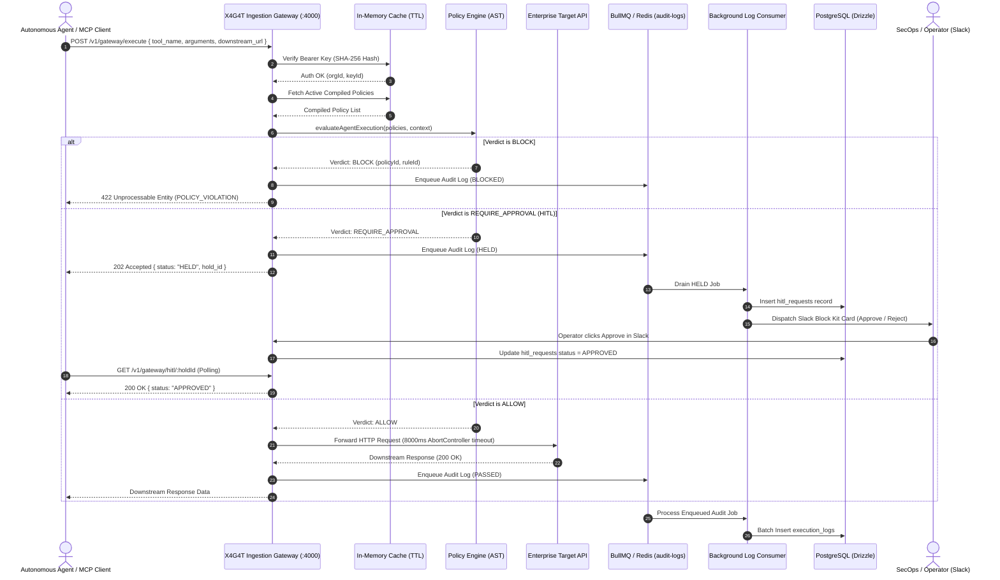

# X4G4T: Technical Architecture & System Design

This document details the architectural blueprint, component boundaries, network topologies, latency budgets, and fail-safe designs for X4G4T.

---

## 1. System Topology: Centralized Gateway Architecture

X4G4T acts as a **Centralized Inline Gateway & Firewall** sitting directly in the execution path between polyglot AI agent runtimes (OpenAI ChatGPT, Google Gemini, Anthropic Claude, LangChain, Cursor, Claude Desktop) and your upstream enterprise APIs / microservices (Stripe, Postgres, Salesforce, AWS, internal SaaS).

```
                      ┌────────────────────────────────────────────────────────┐
                      │          X4G4T CENTRALIZED GATEWAY (:4000)          │
  Polyglot AI Agents  │                                                        │       Downstream Targets
┌───────────────────┐ │  ┌──────────────────────────────────────────────────┐  │     ┌───────────────────┐
│ ChatGPT / OpenAI  │ │  │ 1. Dual-Mode Auth: Static Keys & IAM JWTs        │  │ ──► │ Stripe / Payments │
└─────────┬─────────┘ │  │    (Clerk, WorkOS, Okta, Cognito, Azure AD)      │  │     └───────────────────┘
          │           │  ├──────────────────────────────────────────────────┤  │
┌─────────┴─────────┐ │  │ 2. In-Memory AST Evaluator (<0.15µs per call)   │  │     ┌───────────────────┐
│ Google Gemini     │ ┼─►│    - Tool matching & dot-path extraction         │  │ ──► │ PostgreSQL / SQL  │
└─────────┬─────────┘ │  │    - Numerical bounds, regex, enum operators     │  │     └───────────────────┘
          │           │  │    - IAM role/group permissions enforcement      │  │
┌─────────┴─────────┐ │  ├──────────────────────────────────────────────────┤  │     ┌───────────────────┐
│ Anthropic Claude  │ │  │ 3. Zero-Trust Credential Vaulting                │  │ ──► │ AWS / Kubernetes  │
└─────────┬─────────┘ │  │    - Injects downstream secrets upon ALLOW       │  │     └───────────────────┘
          │           │  │    - LLMs never see production credentials       │  │
┌─────────┴─────────┐ │  ├──────────────────────────────────────────────────┤  │
│ Cursor / MCP      │ │  │ 4. GDPR / DPDP PII Sanitization & ISO 27001 Log  │  │
│ (tools/call)      │ │  │    - Tamper-evident SHA-256 hash chaining        │  │
└───────────────────┘ │  └────────────────────────┬─────────────────────────┘  │
                      └───────────────────────────┼────────────────────────────┘
                                                  │
                                                  ▼ (On REQUIRE_APPROVAL)
                                 ┌──────────────────────────────────────────────────┐
                                 │ Multi-Channel Human-in-the-Loop (HITL) Intercept  │
                                 │ ├── 1. In-Portal Console (/dashboard/approvals)  │
                                 │ ├── 2. SMTP Email Alerts (1-Click Approve Links) │
                                 │ └── 3. Slack / Teams Interactive Block Kit Cards │
                                 └──────────────────────────────────────────────────┘
```

### Architectural Guarantees:
1. **Zero-Trust Credential Vaulting**: The LLM and agent application never see downstream credentials (Stripe keys, database passwords, AWS credentials). X4G4T securely injects them only when execution is permitted.
2. **Polyglot & Multi-Provider Support**: A single gateway serves OpenAI ChatGPT, Google Gemini, Anthropic Claude, Ollama, Python (LangChain/CrewAI), and Model Context Protocol (MCP) clients (Cursor, Claude Desktop).
3. **Multi-Channel HITL Approvals**: High-impact tool executions can be approved directly in the **X4G4T Admin Portal** (`/dashboard/approvals`), via **SMTP email alerts** with one-click links, or via **Slack Block Kit** action buttons.
4. **Pluggable External Log Streaming**: Telemetry is asynchronously dispatched to **Elasticsearch / OpenSearch** and **Generic External Webhooks** (Datadog, Splunk, Loki) with zero overhead on hot-path agent execution.
5. **IAM Group & Role Enforcement**: Ingests enterprise IAM JWTs and custom `x-iam-*` headers to enforce role-based rules (`iam.roles`, `iam.groups`, `iam.userId`).
6. **Deterministic In-Memory Guardrails**: Pure in-memory AST evaluation evaluates in **$<0.15\,\mu\text{s}$** ($0.00015\,\text{ms}$) with **$0.061\,\text{ms}$ P50 gateway latency**.

### Request Flow Sequence


---

## 2. In-Memory Cache & Latency Budgets

### Hot-Path Latency Breakdown
Inline proxy interception must not introduce noticeable lag into LLM agent loops. The latency budget is budgeted as follows:

| Stage | Mechanism | Target Duration |
| :--- | :--- | :--- |
| **Header Parsing & Validation** | Zod schema parsing | $<1.0\text{ms}$ |
| **Authentication** | In-memory SHA-256 token hash map (5-minute TTL) | $<0.5\text{ms}$ |
| **Policy Retrieval** | In-memory compiled policy map per `org_id` (60-second TTL) | $<0.5\text{ms}$ |
| **Policy Evaluation** | Pure in-memory AST operator comparison | $<1.0\text{ms}$ |
| **Audit Log Dispatch** | BullMQ Redis queue `LPUSH` | $<2.0\text{ms}$ |
| **Total Ingestion Engine Overhead** | Excluding downstream network transit | **$<5.0\text{ms}$** |

### Cache Invalidation Strategy
- **Policies:** Cached per organization for 60 seconds. Updates in the dashboard automatically invalidate the local cache or expire gracefully within 1 minute.
- **API Keys:** Cached by token hash for 5 minutes. Revocations via Server Actions flag the database immediately and clear in-memory token entries.

---

## 3. Storage Layer Architecture

### PostgreSQL (Control Plane & Transaction Logs)
Managed via **Drizzle ORM** with PostgreSQL (Neon / Supabase):
- `organizations`: Root tenant record.
- `api_keys`: SHA-256 hashed secret tokens linked to organizations.
- `policies`: Tool-level rulesets with default actions (`ALLOW`, `BLOCK`, `REQUIRE_APPROVAL`).
- `policy_rules`: Field dot-path constraints with comparison operators.
- `execution_logs`: Immutable, append-only records of every intercepted tool call.
- `hitl_requests`: Active and historical Human-in-the-Loop review states.

### ClickHouse (Future Scale / High-Write Log Partitioning)
For enterprises processing millions of tool calls daily, the BullMQ consumer worker can batch insert audit records directly into ClickHouse partitioned by `(org_id, toYYYYMM(created_at))` with zero impact on PostgreSQL relational queries.

---

## 4. Model Context Protocol (MCP) Gateway Design

X4G4T natively implements the Model Context Protocol JSON-RPC 2.0 specification:
1. **Lifecycle & Discovery (`tools/list`, `initialize`, `ping`):** Passed through transparently to the upstream MCP server designated by the `X-Target-MCP-URL` header.
2. **Execution Interception (`tools/call`):** Intercepts the request frame, extracts `params.name` and `params.arguments`, and runs evaluation against the tenant's security policies.
3. **Violation Handling:** When a tool call violates a policy, the gateway converts the violation into a standard JSON-RPC 2.0 error response:
   ```json
   {
     "jsonrpc": "2.0",
     "id": 12,
     "error": {
       "code": -32001,
       "message": "Execution blocked by policy: Tool argument 'amount' exceeded threshold limit of $250.",
       "data": {
         "tool": "issue_refund",
         "policyId": "pol_123",
         "ruleId": "rule_456"
       }
     }
   }
   ```

---

## 5. Security & Fail-Safe Architecture

- **Fail-Open vs. Fail-Closed:**
  - *Staging / Development:* Configurable to Fail-Open so that proxy misconfigurations or network glitches do not disrupt developer testing.
  - *Production:* Strictly enforced **Fail-Closed**. Any unparseable payload, database disconnection, or internal evaluator error results in an immediate denial (`422` or `500`), preventing unauthorized downstream actions.
- **Zero Plain-Text Secrets:** API keys are never stored in plain text. Only an unhashed prefix (`sec_live_9a1b`) is kept for UI display, while the full token is hashed with SHA-256.
- **Downstream Circuit Breaker:** An explicit 8000ms hard timeout is enforced via `AbortController` on all outbound HTTP calls to prevent downstream SaaS unresponsiveness from holding proxy connections open.

---

## 6. Emergency Global AI / LLM Lockdown Kill-Switch

X4G4T incorporates an edge-level emergency kill-switch designed for SecOps incident response:
1. **Edge Interception (<0.5ms):** When engaged, every request hitting `/v1/gateway/execute` is immediately halted with HTTP 503 (`AI_LOCKDOWN_ACTIVE`) before database lookups or policy AST evaluation.
2. **Deterministic Circuit Breaking:** Downstream requests to external LLM providers (OpenAI, Gemini, Anthropic) or internal tool targets are completely suspended.
3. **Telemetry Maintained:** All blocked attempts are logged asynchronously to Elasticsearch and external SIEM webhooks with `triggeredPolicyId: "pol_emergency_ai_lockdown"`.

---

## 7. RBAC Policy Lockdown & Zero-Trust Key Substitution

X4G4T enforces strict Separation of Duties (SoD) across enterprise personas:
1. **Zero-Trust Key Substitution:** Developers and autonomous agents interact with X4G4T using IAM user-specific keys (`sec_live_usr_<id>_...`). Master provider keys (`sk-proj-...`, GCP Service Accounts, AWS STS credentials) reside exclusively in the X4G4T secure vault and are injected at the edge upon policy approval.
2. **RBAC Policy Lockdown:**
   - **Developers (`role: "developer"`):** Authenticate via SSO, generate and revoke personal API keys, configure personal LLM vault preferences, and view personal execution traces. They **CANNOT** view, edit, or toggle guardrail policies (`/dashboard/policies` locked, Server Actions enforce 403 Forbidden).
   - **SecOps Administrators (`role: "admin"`):** Author guardrails, deploy from the Predefined Security Library, resolve HITL approval holds, and control the Emergency Global AI Lockdown kill-switch.

