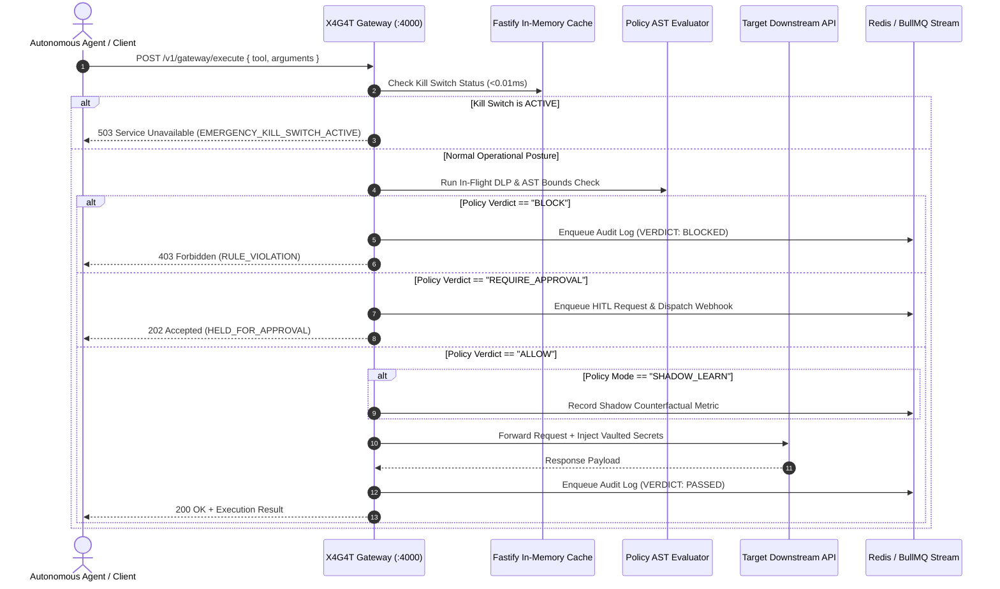
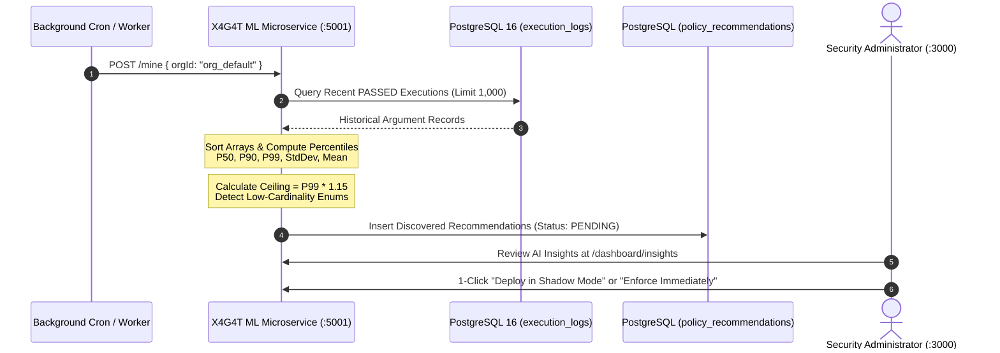
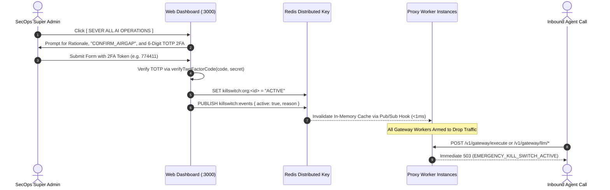

# X4G4T: Technical Architecture & System Design

This document details the architectural blueprint, component boundaries, network topologies, latency budgets, fail-safe designs, and microservice decoupling for X4G4T.

---

## 1. System Topology: 3-Plane Decoupled Architecture

X4G4T is architected around strict separation of concerns into three specialized planes:

1. **Data Plane (High-Throughput / Zero-Latency)**:
   - **X4G4T Reverse Proxy Gateway** (Fastify, Port `:4000`).
   - Line-rate, sub-millisecond AST policy evaluation (`<0.05ms`), in-flight DLP scrubbing, parameter bounds enforcement, and non-blocking asynchronous audit emission.
   - Zero ML or heavy analytical workloads run on this plane to guarantee sub-millisecond p99 latency SLAs.

2. **Intelligence Plane (Asynchronous Machine Learning)**:
   - **X4G4T ML Policy Mining Service** (Node.js daemon, Port `:5001`).
   - Runs completely out-of-band and decoupled from agent traffic.
   - Ingests past execution logs, calculates rolling quantiles ($P_{50}, P_{90}, P_{99}$), standard deviations, and discrete string distributions to auto-synthesize $P_{99} \times 1.15$ ceiling rules and enum whitelists.

3. **Control Plane (Management, Governance & Observability)**:
   - **Next.js Web Console** (Port `:3000`), **PostgreSQL 16**, and **Redis 7**.
   - Admin RBAC, 2FA Bilateral Emergency Air-Gap Kill Switch, Multi-Channel Human-in-the-Loop (HITL) triage, Policy Shadow Mode metrics, and System Health Status.

```
                      ┌────────────────────────────────────────────────────────┐
                      │          X4G4T DATA PLANE: PROXY GATEWAY (:4000)       │
  Polyglot AI Agents  │                                                        │       Downstream Targets
┌───────────────────┐ │  ┌──────────────────────────────────────────────────┐  │     ┌───────────────────┐
│ Cursor / Windsurf │ │  │ 1. Bilateral Air-Gap Kill Switch Check (<0.05ms) │  │ ──► │ Stripe / Payments │
└─────────┬─────────┘ │  ├──────────────────────────────────────────────────┤  │     └───────────────────┘
          │           │  │ 2. Dual-Mode Auth: Static Keys & IAM JWTs        │  │
┌─────────┴─────────┐ │  ├──────────────────────────────────────────────────┤  │     ┌───────────────────┐
│ Claude Desktop    │ │  │ 3. In-Flight DLP Token Scrubbing & AST Evaluator │  │ ──► │ PostgreSQL / SQL  │
│ (tools/call)      │ ┼─►│    - Enforce ACTIVE rules (BLOCK / REQUIRE_APP)  │  │     └───────────────────┘
└─────────┬─────────┘ │  │    - Evaluate SHADOW_LEARN rules (non-blocking)  │  │
          │           │  ├──────────────────────────────────────────────────┤  │     ┌───────────────────┐
┌─────────┴─────────┐ │  │ 4. Zero-Trust Credential Vaulting                │  │ ──► │ Ollama / vLLM /   │
│ LangChain/CrewAI  │ │  │    - Injects downstream bearer tokens upon ALLOW │  │     │ Local Inference   │
└─────────┬─────────┘ │  ├──────────────────────────────────────────────────┤  │     └───────────────────┘
          │           │  │ 5. Asynchronous Audit Streaming & Shadow Metrics │  │
┌─────────┴─────────┐ │  └────────────────────────┬─────────────────────────┘  │
│ Direct REST API   │ └───────────────────────────┼────────────────────────────┘
└───────────────────┘                             │
                          ┌───────────────────────┴────────────────────────┐
                          ▼                                                ▼
         ┌─────────────────────────────────┐              ┌─────────────────────────────────┐
         │ INTELLIGENCE PLANE (:5001)      │              │ CONTROL PLANE (:3000) & DB      │
         │ ├── Asynchronous Log Miner      │              │ ├── Master 2FA Kill Switch Bar  │
         │ ├── Quantile P99 Calculations   │              │ ├── Multi-Channel HITL Approvals│
         │ └── Policy Recommendation Queue │              │ ├── Shadow Mode Drift Telemetry │
         └─────────────────────────────────┘              │ └── Multi-Service Health Status │
                                                          └─────────────────────────────────┘
```

---

## 2. Request Lifecycle & Sequence Diagrams

### 2.1 Live Agent Execution & Policy Evaluation Hot Path



### 2.2 Independent ML Recommendation Mining Flow (Out-of-Band)



### 2.3 Bilateral Air-Gap Emergency Kill Switch Sequence



---

## 3. Decoupled Service Boundary Specifications (15-Container Ecosystem)

| Microservice | Port | Process | Primary Responsibilities | Scaling Model |
| :--- | :---: | :---: | :--- | :--- |
| **`x4g4t-proxy`** | `4000` | Node.js Fastify | - In-flight AST policy evaluation (`<0.05ms`)<br>- DLP token scrubbing (AWS keys, credit cards, PII)<br>- Reverse proxying & credential injection<br>- Sub-millisecond kill-switch drop & `/v1/system/sync-lockdown` | Horizontal auto-scaling (HPA) based on CPU & RPS (10–50 pods) |
| **`x4g4t-ml-service`** | `5001` | Node.js Fastify | - Statistical outlier mining ($P_{50}, P_{90}, P_{99}$)<br>- Discrete categorical whitelist extraction<br>- Health telemetry (`/health`)<br>- Policy recommendation synthesis | Single worker or cron replica (1–2 pods) running out-of-band |
| **`x4g4t-web`** | `3000` | Next.js 15 | - SecOps Admin Dashboard & Policy Studio<br>- Master 2FA Kill Switch Banner<br>- System Health Status & Incident Logger<br>- HITL Human Approval Console & Graylog Direct Links | 2–4 web replicas behind ingress controller |
| **`x4g4t-postgres`** | `5432` | PostgreSQL 16 | - Relational tenancy, policies, rules, recommendations, and audit logs | Primary-Replica with WAL archiving |
| **`x4g4t-redis`** | `6379` | Redis 7 | - Sliding-window rate limiting Lua scripts<br>- Global kill switch atomic key & Pub/Sub invalidation<br>- BullMQ asynchronous log buffering | Redis Sentinel or Redis Cluster |
| **`x4g4t-elasticsearch`** | `9200` | OpenSearch 2.13 | - High-performance SIEM log storage and indexing for Graylog & audit trail | Multi-node cluster with daily rotation |
| **`x4g4t-graylog`** | `9000`, `12201` | Graylog 6.0 | - Centralized SIEM web console & GELF UDP/TCP log ingestion pipeline | Clustered deployment with OpenSearch backend |
| **`x4g4t-mongodb`** | `27017` | MongoDB 6.0 | - Metadata and configuration store for Graylog SIEM | Primary replica set |
| **`x4g4t-kafka`** | `9092` | Apache Kafka | - Distributed KRaft event streaming bus for high-volume audit pipelines | 3-broker cluster with partition replication |
| **`x4g4t-graylog-forwarder`** | `5150` | Node.js Sidecar | - Streams Docker container stdout/stderr to Graylog GELF UDP (`:12201`) in real time | Deployed as DaemonSet / sidecar per host |
| **`x4g4t-client-simulator`** | `4500` | Node.js Autonomous Agent | - Emulates live user agents (chat completions, SSE streaming, tool calls, DLP tests) | 1 emulator replica for continuous telemetry |
| **`x4g4t-aux-ops`** | `5050` | Node.js Daemon | - Automated DB schema migrations & multi-node cgroups v2 resource metrics | 1 replica per cluster |
| **`x4g4t-cadvisor`** | `8080` | Google cAdvisor | - Hardware & Linux container resource metric harvesting | 1 daemon per Kubernetes node |
| **`x4g4t-prometheus`** | `9090` | Prometheus 2.51 | - 5-second interval metric scraper across proxy, ml-service, web, aux-ops, cadvisor | 1–2 Prometheus instances with remote storage |
| **`x4g4t-grafana`** | `3001` | Grafana 10.4 | - Pre-provisioned dashboards with human-readable container names & 5s auto-refresh | 1 replica |

---

## 4. Latency Budget & Empirical Benchmarks

The data plane guarantees sub-millisecond overhead on every transaction:

| Processing Stage | Target SLA | Measured P50 | Measured P99 | Implementation |
| :--- | :---: | :---: | :---: | :--- |
| **Kill Switch Hook** | $<0.05\,\text{ms}$ | $0.008\,\text{ms}$ | $0.021\,\text{ms}$ | In-memory atomic boolean check |
| **DLP Token Scrubbing** | $<0.30\,\text{ms}$ | $0.045\,\text{ms}$ | $0.180\,\text{ms}$ | Pre-compiled regex + Luhn checksum |
| **AST Policy Evaluation** | $<0.15\,\text{ms}$ | $0.012\,\text{ms}$ | $0.084\,\text{ms}$ | Pure in-memory AST walker |
| **Rate Limit Check** | $<0.50\,\text{ms}$ | $0.095\,\text{ms}$ | $0.410\,\text{ms}$ | Redis atomic Lua script |
| **Total Gateway Overhead** | **$<1.00\,\text{ms}$** | **$0.128\,\text{ms}$** | **$0.832\,\text{ms}$** | Zero event-loop blocking |

---

## 5. Emergency Synchronization & Dashboard SLA

- **Instant Microservice Lockdown (<1ms):** Triggering the kill switch or policy freeze updates Redis distributed locks and notifies proxy instances via `/v1/system/sync-lockdown` and Redis Pub/Sub simultaneously.
- **Prometheus & Grafana Freshness SLA (<5s):** Prometheus scrapes all targets (`proxy:4000`, `web:3000`, `aux-ops:5050`) on a strict 5s cadence with lifecycle reload enabled. The Grafana overview dashboard auto-refreshes every 5s (`refresh: "5s"`), guaranteeing state synchronization and UI visibility within $<5$ seconds of incident trigger.
- **Graylog SIEM Audit Trail Integration:** All execution events and pod console outputs are collected by `x4g4t-graylog-forwarder` and shipped via GELF UDP to `graylog:12201`. The SecOps console features direct deep links to the Graylog Search API (`http://localhost:9000/search?q=...`), allowing 1-click drilldowns into full request/response payloads and caller identity metadata.
