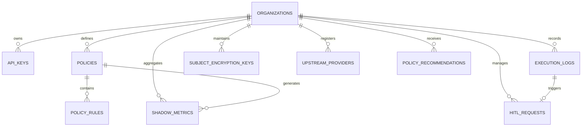
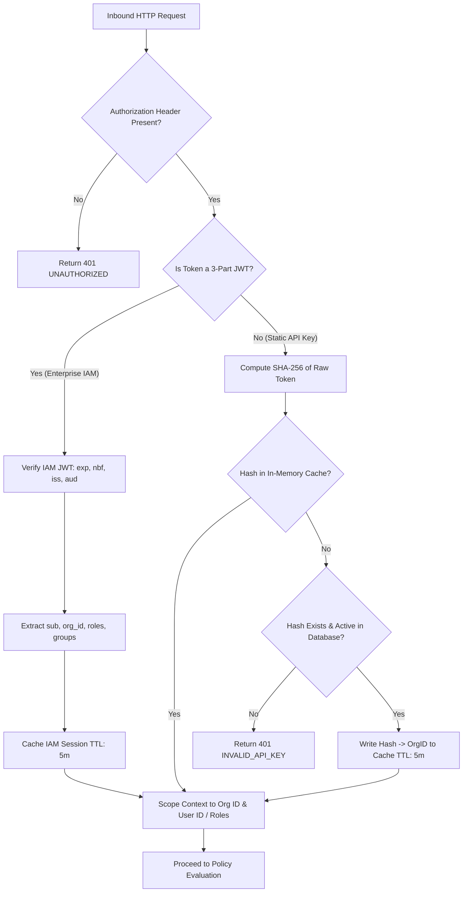
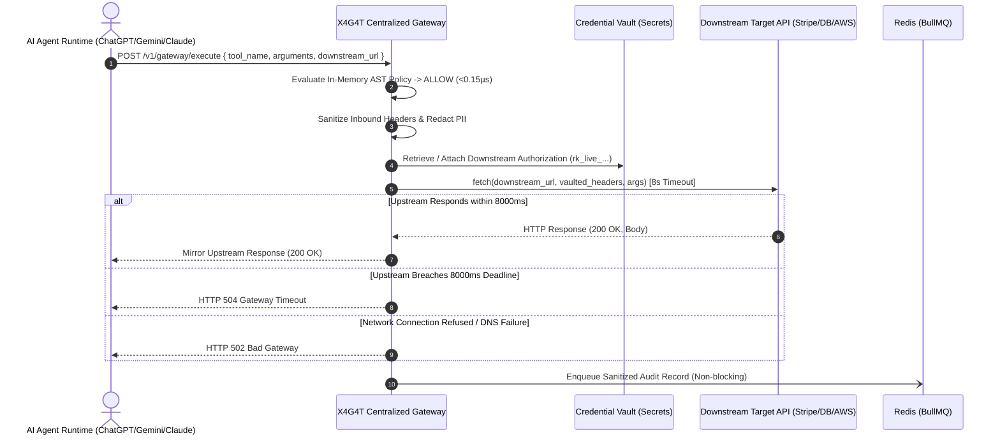
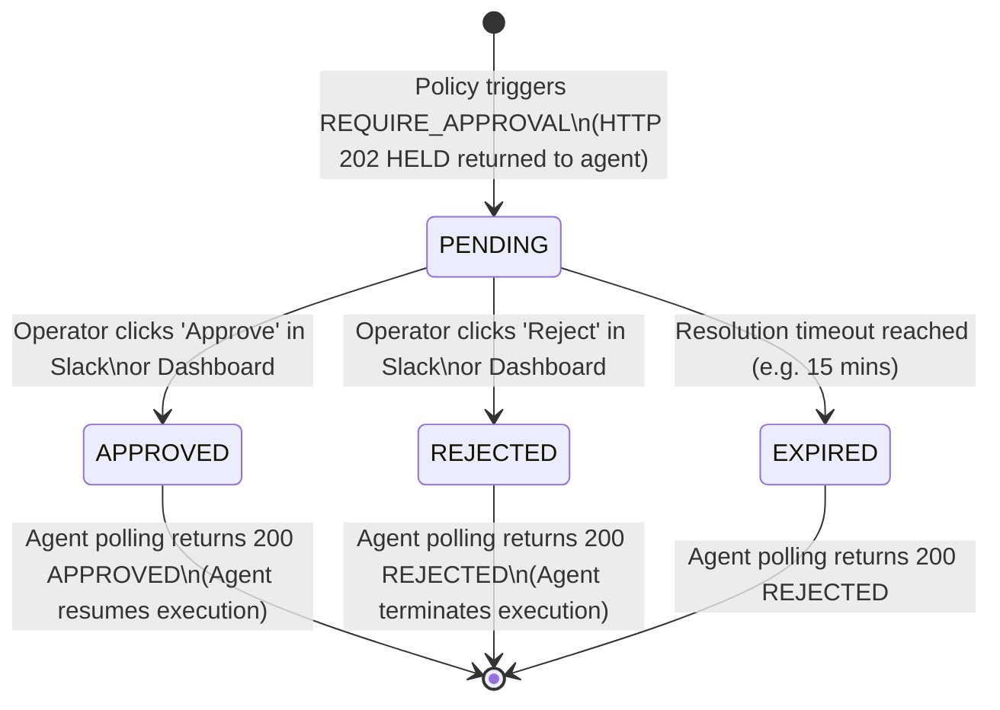
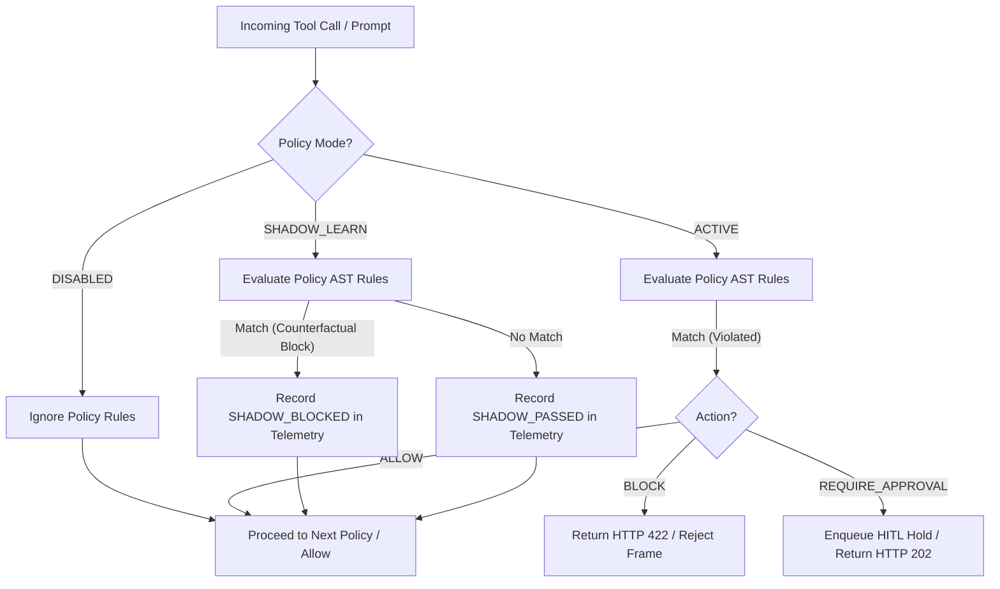
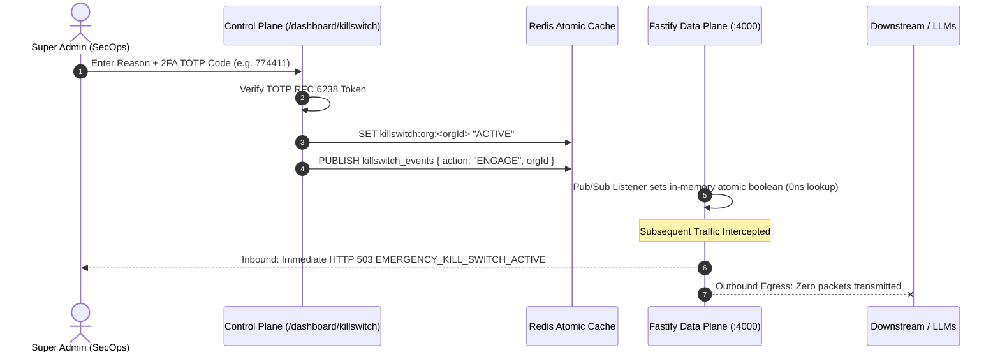
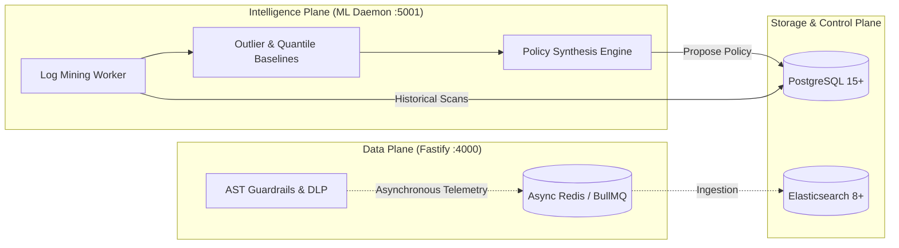

# X4G4T: End-to-End Business Logic & System Invariants

This document serves as the authoritative specification of the **business logic, state machines, mathematical models, evaluation semantics, and failure modes** governing the X4G4T platform.

---

## Table of Contents
1. [Domain Model & Entity Relationships](#1-domain-model--entity-relationships)
2. [Gateway Authentication & Multi-Tenancy Logic](#2-gateway-authentication--multi-tenancy-logic)
3. [Deterministic Policy Evaluation Engine](#3-deterministic-policy-evaluation-engine)
   - [Rule Evaluation Semantics (AND-Condition AST)](#rule-evaluation-semantics-and-condition-ast)
   - [Field-Path Resolution & Type Coercion](#field-path-resolution--type-coercion)
   - [Operator Evaluation Matrix](#operator-evaluation-matrix)
   - [Verdict Precedence & Conflict Resolution](#verdict-precedence--conflict-resolution)
4. [Downstream Forwarding & Circuit Breaking](#4-downstream-forwarding--circuit-breaking)
5. [Human-in-the-Loop (HITL) State Machine](#5-human-in-the-loop-hitl-state-machine)
6. [Asynchronous Telemetry & Hash Chaining Logic](#6-asynchronous-telemetry--hash-chaining-logic)
   - [BullMQ Asynchronous Decoupling](#bullmq-asynchronous-decoupling)
   - [ISO/IEC 27001 Cryptographic Hash Chaining](#isoiec-27001-cryptographic-hash-chaining)
7. [Data Privacy & Crypto-Shredding Mechanics](#7-data-privacy--crypto-shredding-mechanics)
   - [In-Flight PII Redaction](#in-flight-pii-redaction)
   - [GDPR Art. 17 / DPDP Sec. 12 Crypto-Shredding](#gdpr-art-17--dpdp-sec-12-crypto-shredding)
8. [Model Context Protocol (MCP) JSON-RPC 2.0 Router](#8-model-context-protocol-mcp-json-rpc-20-router)
9. [Policy Deployment Modes & Counterfactual Testing](#9-policy-deployment-modes--counterfactual-testing)
10. [Bilateral Emergency Air-Gap Kill Switch with 2FA](#10-bilateral-emergency-air-gap-kill-switch-with-2fa)
11. [Decoupled ML Intelligence Plane & Outlier Mining](#11-decoupled-ml-intelligence-plane--outlier-mining)
12. [In-House & Custom LLM Provider Governance](#12-in-house--custom-llm-provider-governance)
13. [RBAC Policy Lockdown & Separation of Duties (SoD)](#13-rbac-policy-lockdown--separation-of-duties-sod)
14. [Failure Modes, Fail-Closed Defaults & Edge Cases](#14-failure-modes-fail-closed-defaults--edge-cases)

---

## 1. Domain Model & Entity Relationships

The X4G4T data model enforces strict tenant isolation, auditable key lifecycles, configurable guardrail policies, tamper-evident logs, GDPR-compliant crypto-shredding keys, shadow telemetry aggregates, and automated ML-synthesized policy recommendations.



### Entity Business Invariants

| Entity | Primary Keys & Indexes | Business Rules & Invariants |
| :--- | :--- | :--- |
| `organizations` | `id` (UUID / text) | - Represents an isolated enterprise tenant.<br>- Defines `retention_days` (default: 90 days).<br>- Stores `kill_switch_active`, `kill_switch_activated_at`, `kill_switch_reason`, and `kill_switch_two_factor_secret`.<br>- All queries across tables must be scoped by `org_id`. |
| `api_keys` | `id` (UUID), `key_hash` (unique) | - Secret key generated with prefix `sec_live_` + 24 cryptographically random bytes.<br>- Plain-text key is **never** stored in the database.<br>- Only `SHA-256(raw_key)` is persisted.<br>- Revoked keys (`deleted_at IS NOT NULL`) are permanently rejected. |
| `policies` | `id` (UUID), `org_id` | - Target tool specifies the exact tool name or `*` (wildcard matching all tools).<br>- `mode` must be one of: `ACTIVE`, `SHADOW_LEARN`, or `DISABLED`.<br>- `action_on_match` must be one of: `ALLOW`, `BLOCK`, `REQUIRE_APPROVAL`.<br>- Toggling `mode` or `is_active` immediately alters runtime evaluation. |
| `policy_rules` | `id` (UUID), `policy_id` | - Belongs to exactly one policy.<br>- Defines `field_path` (nested dot-notation), `operator`, and `target_value`.<br>- Multiple rules within a policy evaluate under **AND** semantics. |
| `execution_logs` | `id` (UUID), `org_id`, `created_at` | - Append-only immutable audit trail.<br>- Stores `record_hash` and `previous_record_hash` forming a cryptographic blockchain-like ledger.<br>- Personal data arguments are encrypted or sanitized. |
| `hitl_requests` | `id` (UUID), `org_id` | - Stateful request created when a policy triggers `REQUIRE_APPROVAL`.<br>- Transitions: `PENDING` $\rightarrow$ `APPROVED` \| `REJECTED` \| `EXPIRED`.<br>- Must record `reviewer_id` and `resolved_at` upon terminal state. |
| `subject_encryption_keys` | `id` (UUID), `subject_id` (unique) | - Stores unique AES-256-GCM symmetric keys for individual data subjects.<br>- Destroying this key cryptographically erases all associated execution logs. |
| `upstream_providers` | `id` (UUID), `org_id` | - Configures internal LLM runtime endpoints (`OLLAMA`, `OPENAI_COMPATIBLE`, `ANTHROPIC`, `CUSTOM`).<br>- Stores base URLs (e.g., `http://ollama:11434`, `http://vllm:8000`) and optional vault credentials. |
| `policy_recommendations` | `id` (UUID), `org_id`, `status` | - Generated automatically by the decoupled ML Intelligence Plane.<br>- Proposes candidate rules based on statistical outlier analysis ($P_{99} \times 1.15$).<br>- Status transitions: `PENDING` $\rightarrow$ `ACCEPTED` \| `DISMISSED`. |
| `shadow_metrics` | `id` (UUID), `policy_id`, `bucket_hour` | - Hourly rollup buckets recording `total_evaluated`, `would_have_blocked`, and `would_have_passed` for shadow-mode candidate policies. |

---

## 2. Gateway Authentication & Multi-Tenancy Logic

All inbound requests to the Centralized Gateway (`/v1/gateway/execute` and `/v1/gateway/mcp`) pass through the dual-mode zero-trust authentication layer.



### Business Rules:
1. **Dual-Mode Header Support:**
   - **Enterprise IAM JWT**: `Authorization: Bearer eyJ...` issued by Clerk, WorkOS, Okta, AWS Cognito, or Azure AD / Microsoft Entra ID.
   - **Static API Key**: `Authorization: Bearer sec_live_<token>` (256-bit entropy token).
2. **Deterministic Hash Calculation for Static Keys:**
   $$\text{Key Hash} = \text{SHA-256}(\text{raw\_token})$$
3. **In-Memory Caching (SLA Guard):** To prevent database round-trips on every request, verified sessions and key hashes are cached in an in-memory `Map` with a **5-minute TTL**.
4. **IAM Context Propagation:** User ID, organization ID, RBAC roles, and group memberships are attached to the request context for policy evaluation.
5. **Tenant Isolation:** All policy lookups, audit logs, and Human-in-the-Loop holds are strictly partitioned by `org_id`.

---

## 3. Deterministic Policy Evaluation Engine

The policy engine operates entirely in-memory as a pure Abstract Syntax Tree (AST) evaluator without external network calls or database reads.

### Rule Evaluation Semantics (AND-Condition AST)

A policy contains one or more `policy_rules`. For a policy to match:
1. **Tool Name Matching:** `policy.targetTool === "*"` OR `policy.targetTool === context.toolName`.
2. **Rule Conjunction (AND Semantics):** **Every single rule** in `policy.rules` must evaluate to `true`. If any rule evaluates to `false`, the policy does not match, and evaluation proceeds to the next policy.

$$\text{PolicyMatches}(P, C) = (P.\text{tool} = * \lor P.\text{tool} = C.\text{tool}) \land \left( \bigwedge_{r \in P.\text{rules}} \text{EvalRule}(r, C.\text{args}) \right)$$

```mermaid
flowchart TD
    Start[Evaluate Policies for Tool] --> LoopPol[Iterate Next Policy in Org]
    LoopPol --> MatchTool{Tool Matches or '*'?}
    MatchTool -- No --> LoopPol
    MatchTool -- Yes --> LoopRules[Iterate Rules in Policy]
    LoopRules --> ExtractVal[Extract Field Value via Dot-Path]
    ExtractVal --> EvalOp{Operator Evaluates to True?}
    EvalOp -- No --> LoopPol
    EvalOp -- Yes --> MoreRules{More Rules in this Policy?}
    MoreRules -- Yes --> LoopRules
    MoreRules -- No --> MatchFound[Policy Matches!]
    MatchFound --> TriggerAction[Return Policy Action: BLOCK | REQUIRE_APPROVAL | ALLOW]
    LoopPol -- Exhausted --> DefaultAllow[No Match: Return ALLOW]
```

---

### Field-Path Resolution & Type Coercion

The engine resolves nested properties using dot-notation:
- Example: `"transaction.customer.email"` resolves `context.arguments["transaction"]["customer"]["email"]`.
- Example: `"items.0.price"` resolves array indices.
- **Missing Fields:** If a path does not exist, it resolves to `undefined`.
  - Non-existence checks (`EQUALS` with `"null"` or `"undefined"`) evaluate appropriately.
  - Numeric or regex comparisons against `undefined` evaluate to `false`.

---

### Operator Evaluation Matrix

| Operator | Type Handling | Logic & Evaluation Rule | Edge Cases |
| :--- | :--- | :--- | :--- |
| `EQUALS` | String / Number / Boolean | Strict equality after string normalization (`String(actual) === String(target)`). | Case-sensitive. Numeric `100` equals `"100"`. |
| `NOT_EQUALS` | String / Number / Boolean | Inverted equality (`String(actual) !== String(target)`). | Returns `true` if field is undefined and target is not `"undefined"`. |
| `GREATER_THAN` | Numeric | Coerces both to `Number`. Returns `actualNum > targetNum`. | Returns `false` if `isNaN(actual)` or `isNaN(target)`. |
| `LESS_THAN` | Numeric | Coerces both to `Number`. Returns `actualNum < targetNum`. | Returns `false` if `isNaN(actual)` or `isNaN(target)`. |
| `GREATER_THAN_OR_EQUAL` | Numeric | Coerces both to `Number`. Returns `actualNum >= targetNum`. | Returns `false` if NaN. |
| `LESS_THAN_OR_EQUAL` | Numeric | Coerces both to `Number`. Returns `actualNum <= targetNum`. | Returns `false` if NaN. |
| `CONTAINS` | String | Substring check: `String(actual).includes(String(target))`. | Case-sensitive substring. |
| `REGEX` | String (Pattern) | Evaluates `new RegExp(pattern, flags).test(String(actual))`. | Automatically parses PCRE `(?i)` and inline flags `/pattern/i` into JS `RegExp` flags. |
| `IN` | Delimited List | Splits target by comma `,`, trims whitespace, and checks set inclusion. | Target `"US, CA, GB"` matches `"US"`. |

---

### Verdict Precedence & Conflict Resolution

When multiple policies target the same tool:
1. Policies are evaluated in the order configured by the administrator.
2. The **first matching policy** determines the immediate verdict.
3. If no policies match, the engine defaults to **`ALLOW`**.

---

## 4. Downstream Forwarding, Circuit Breaking & Credential Vaulting

When a tool call receives the **`ALLOW`** verdict, X4G4T acts as a secure credential vault and transparent proxy:



### Business Invariants:
1. **Zero-Trust Credential Vaulting:** The AI model and agent application never receive or hold downstream production credentials. The gateway injects authorized tokens (`downstream_headers`) in flight only after policy verification passes.
2. **Zero Hot-Path Database Writes:** Telemetry is pushed to BullMQ via Redis. The agent never waits for a database transaction.
3. **Hard 8000ms Circuit Breaker:** Downstream fetches use an `AbortController` capped at 8000ms. If the target service hangs, X4G4T immediately aborts the socket and returns `504 Gateway Timeout`.
4. **Fail-Safe Header Stripping:** Inbound proxy authentication headers (`Authorization: Bearer sec_live_...` or IAM JWTs) are stripped before calling downstream services to prevent token leakage.

---

## 5. Human-in-the-Loop (HITL) State Machine

When a policy triggers **`REQUIRE_APPROVAL`**, the execution is halted and transitioned through the HITL state machine.



### HITL Business Rules:
1. **Agent Suspension:** The gateway returns HTTP 202 `Accepted` with `status: "HELD"`, `hold_id`, and `retry_after_sec: 5`.
2. **Multi-Channel Notification Dispatch:**
   - **In-Portal Admin Console (`/dashboard/approvals`):** Instantly renders pending holds with live JSON argument viewers and 1-click `Approve` / `Reject` buttons.
   - **SMTP Email Notifications:** Sends an HTML alert to `ADMIN_EMAIL` with sanitized arguments, triggered policy name, and direct action links (`/dashboard/approvals?action=approve&holdId=...`).
   - **Slack Block Kit Dispatch:** Formats interactive cards with `Approve Execution` and `Reject / Terminate` buttons.
3. **Idempotency & Concurrency:**
   - Once a hold is marked `APPROVED` or `REJECTED`, subsequent button clicks or webhook invocations return the existing state without duplicate writes.
   - Both Slack and the Admin Portal display the reviewer's identity and timestamp, preventing dual reviews.
4. **Agent Polling Loop:**
   - Agent polls `GET /v1/gateway/hitl/:holdId`.
   - If `PENDING`: returns HTTP 202.
   - If resolved: returns HTTP 200 with `{ "status": "APPROVED" | "REJECTED", "reviewer": "...", "resolved_at": "..." }`.

---

## 6. Asynchronous Telemetry, Hash Chaining & External Log Streaming

### BullMQ Asynchronous Decoupling & External Exporters

All audit logs are dispatched asynchronously with zero hot-path database latency:
1. **Primary Audit Queue:** Pushed to BullMQ Redis queue `audit-logs` for batched PostgreSQL persistence.
2. **Elasticsearch / OpenSearch Stream:** Dispatched to `POST {ELASTICSEARCH_URL}/{INDEX}/_doc` with `@timestamp` and full execution context.
3. **Generic External Webhook Stream:** Dispatched to `POST {EXTERNAL_LOG_WEBHOOK_URL}` for ingestion into Datadog, Splunk, Logstash, or Loki.
4. **Latency Guarantee:** All external log writes run in non-blocking background workers or via `waitUntil()`, adding **$0\text{ms}$** to proxy execution latency.
- Payload contains: `{ orgId, agentId, toolName, arguments, verdict, triggeredPolicyId, latencyMs, createdAt }`.
- Redis writes complete in $<2\text{ms}$.

---

### ISO/IEC 27001 Cryptographic Hash Chaining

To satisfy **ISO/IEC 27001:2022 Control A.8.15 (Logging and Monitoring)**, X4G4T structures execution logs as a tamper-evident cryptographic hash chain.

#### Mathematical Hash Formula:
For each log record $R_i$:
$$\text{PayloadToHash}_i = R_i.\text{id} \parallel R_i.\text{previousRecordHash} \parallel R_i.\text{toolName} \parallel R_i.\text{verdict} \parallel R_i.\text{createdAt}$$
$$R_i.\text{recordHash} = \text{SHA-256}(\text{PayloadToHash}_i)$$

Where:
- $R_0.\text{previousRecordHash} = \text{"GENESIS\_BLOCK"}$ (or the previous epoch hash).
- For $i > 0$, $R_i.\text{previousRecordHash} = R_{i-1}.\text{recordHash}$.

```
┌─────────────────────────┐          ┌─────────────────────────┐          ┌─────────────────────────┐
│       Log Record 1      │          │       Log Record 2      │          │       Log Record 3      │
│ PrevHash: GENESIS       │          │ PrevHash: Hash(Log 1)   │          │ PrevHash: Hash(Log 2)   │
│ Tool: issue_refund      │ ───────> │ Tool: wire_transfer     │ ───────> │ Tool: execute_sql       │
│ Verdict: ALLOW          │          │ Verdict: HELD           │          │ Verdict: BLOCKED        │
│ Hash: 8f4a3...          │          │ Hash: e2b91...          │          │ Hash: 1a7c4...          │
└─────────────────────────┘          └─────────────────────────┘          └─────────────────────────┘
```

#### Verification Invariant:
If an attacker alters any field in $R_1$ (e.g., changes `verdict` from `BLOCKED` to `ALLOW`), $R_1.\text{recordHash}$ changes. Because $R_2.\text{previousRecordHash}$ is immutable, the equation $R_2.\text{previousRecordHash} == \text{Hash}(R_1)$ fails, mathematically invalidating the entire subsequent ledger.

---

## 7. Data Privacy & Crypto-Shredding Mechanics

### In-Flight PII Redaction

Before payloads are enqueued for audit logging, string values are scanned with zero-latency regular expressions and redacted:

| Data Type | Pattern | Replacement String |
| :--- | :--- | :--- |
| Email Address | `\b[A-Za-z0-9._%+-]+@[A-Za-z0-9.-]+\.[A-Za-z]{2,}\b` | `[REDACTED_EMAIL]` |
| Credit Card Number | `\b(?:\d{4}[-\s]?){3}\d{4}\b\|\b\d{15,16}\b` | `[REDACTED_CARD]` |
| US SSN | `\b\d{3}-\d{2}-\d{4}\b` | `[REDACTED_SSN]` |
| International IBAN | `\b[A-Z]{2}\d{2}[A-Z0-9]{4}\d{7}([A-Z0-9]?){0,16}\b` | `[REDACTED_IBAN]` |
| Telephone Number | `\b(?:\+?\d{1,3}[-.\s]?)?\(?\d{2,4}\)?[-.\s]?\d{3,4}[-.\s]?\d{3,4}\b` | `[REDACTED_PHONE]` |
| Secret Keys / Tokens | `\b(?:sk_live\|sec_live\|rk_live\|Bearer\s+)[A-Za-z0-9_\-.]+\b` | `[REDACTED_SECRET]` |

---

### GDPR Art. 17 / DPDP Sec. 12 Crypto-Shredding

#### The Legal-Technical Paradox:
- **ISO 27001:** Mandates immutable, append-only audit records.
- **GDPR Article 17 / India DPDP Act Section 12:** Mandates the absolute right to have personal data erased upon request.
- **Problem:** Deleting or modifying a row in `execution_logs` breaks the cryptographic hash chain.

#### The X4G4T Solution:
X4G4T employs **Envelope Crypto-Shredding**:
1. When personal data is logged, it is encrypted using an ephemeral **Subject Encryption Key (SEK)** stored in `subject_encryption_keys` via AES-256-GCM:
   $$\text{Ciphertext} = \text{AES-256-GCM}(\text{Payload}, \text{SEK}_{\text{subject\_id}}, \text{IV})$$
2. The audit metadata (Agent ID, tool name, verdict, timestamp, ciphertext hash) forms the ISO 27001 hash chain.
3. **Erasure Execution:** When an erasure request is received:
   - The database destroys $\text{SEK}_{\text{subject\_id}}$ by overwriting it with cryptographically random noise and deleting the row.
   - Without the key, the ciphertext is **mathematically unrecoverable** (information-theoretic erasure under EU EDPB guidelines).
   - The `execution_logs` row and its `record_hash` remain intact, preserving the integrity of the audit chain.

---

## 8. Model Context Protocol (MCP) JSON-RPC 2.0 Router

The MCP router (`POST /v1/gateway/mcp`) implements the standard Model Context Protocol JSON-RPC 2.0 specification for tools.

```mermaid
flowchart TD
    Req[POST /v1/gateway/mcp] --> ParseRPC{Valid JSON-RPC 2.0?}
    ParseRPC -- No --> Err32600[Return code -32600 Invalid Request]
    ParseRPC -- Yes --> CheckMethod{Method Type?}
    
    CheckMethod -- "tools/list" or "initialize" --> ForwardDiscovery[Pass-through to X-Target-MCP-URL]
    ForwardDiscovery --> ReturnUpstream[Return Upstream JSON-RPC Result]
    
    CheckMethod -- "tools/call" --> ExtractArgs[Extract params.name and params.arguments]
    ExtractArgs --> EvalPolicy[Run In-Memory Policy Evaluator]
    
    EvalPolicy -- "BLOCK" --> Return32001[Return JSON-RPC error -32001 Policy Violation]
    EvalPolicy -- "REQUIRE_APPROVAL" --> ReturnHeld[Return JSON-RPC Result with 'isError: true' and HELD card]
    EvalPolicy -- "ALLOW" --> ForwardTool[Forward tools/call to X-Target-MCP-URL]
    ForwardTool --> ReturnToolResult[Return Upstream Tool Result]
```

### MCP Specifics:
1. **Header Requirement:** Must include `X-Target-MCP-URL` specifying the upstream MCP server. Missing header returns JSON-RPC error code `-32602` (Invalid params).
2. **Error Code `-32001` (Policy Violation):** Standardized application error containing `{ tool, policyId, ruleId }`.
3. **Held Execution:** Returns `isError: true` with a text block: `[X4G4T HELD] Action requires human verification. Reviewers alerted via Slack.`

---

## 9. Policy Deployment Modes & Counterfactual Testing

To eliminate the operational risk of "breaking production" when deploying strict security boundaries, X4G4T supports three operational policy deployment modes:



### Invariants:
1. **Counterfactual Non-Interference:** When a policy is configured in `SHADOW_LEARN` mode, violations **never** alter the execution path. The tool call passes downstream to prevent workflow disruption.
2. **Shadow Telemetry Rollups:** Violations and passes are synchronously recorded as `SHADOW_BLOCKED` or `SHADOW_PASSED` in telemetry tags and aggregated into hourly `shadow_metrics` buckets (`total_evaluated`, `would_have_blocked`, `would_have_passed`).
3. **Blast-Radius & Drift Calculation:** The SecOps console uses counterfactual telemetry to compute the estimated blast radius ($\frac{\text{would\_have\_blocked}}{\text{total\_evaluated}} \times 100\%$) and false-positive likelihood *before* promoting the policy to `ACTIVE`.

---

## 10. Bilateral Emergency Air-Gap Kill Switch with 2FA

When an enterprise detects an active rogue agent loop, multi-agent cascading hallucination, or active prompt injection exfiltration, SecOps can instantly trigger the bilateral air-gap kill switch.



### Invariants:
1. **Mandatory Two-Factor Authentication (2FA):** Toggling the emergency kill switch (both activation and deactivation) strictly requires a valid RFC 6238 Time-Based One-Time Password (TOTP). Static passwords alone cannot trip or reset the circuit breaker.
2. **Bilateral Severance:**
   - **Ingress Air-Gap:** All incoming tool invocations, prompts, and MCP JSON-RPC requests are halted immediately with `HTTP 503 Service Unavailable` (`code: EMERGENCY_KILL_SWITCH_ACTIVE`).
   - **Egress Air-Gap:** All active and pending outbound sockets to cloud LLMs (OpenAI, Anthropic, Gemini) and local inference clusters (Ollama, vLLM) are aborted immediately.
3. **Sub-Millisecond Hot Path Resolution:** The proxy checks an in-memory atomic boolean synced via Redis Pub/Sub, resolving kill-switch checks in $<1\mu\text{s}$ without database or Redis round-trips.

---

## 11. Decoupled ML Intelligence Plane & Outlier Mining

To preserve the zero-latency SLA of the proxy hot path ($<1\text{ms}$ AST evaluation), X4G4T completely decouples machine learning and log-mining analytics into an independent microservice daemon (`:5001`).



### Recommendation Invariants:
1. **Zero Event-Loop Contention:** The proxy process (`:4000`) never runs statistical regressions, quantile calculations, or clustering. All heavy log analytics run on the isolated ML service (`:5001`).
2. **Numeric Safety Ceilings:** For numeric arguments (e.g. `amount`, `max_items`, `discount_rate`), the ML service computes the 99th percentile ($P_{99}$) of non-anomalous historical executions and generates a suggested ceiling with a 15% safety buffer:
   $$\text{Ceiling} = \lceil P_{99} \times 1.15 \rceil$$
3. **Categorical Enumeration Whitelisting:** For string parameters with discrete domains (e.g. `environment`, `role`, `currency`), the engine mines high-frequency values ($>99.5\%$ occurrence) and generates `IN` whitelist policies to prevent injection of unexpected enumerations.
4. **Approval Workflow:** Recommended policies are persisted in `policy_recommendations` with status `PENDING` and must be explicitly reviewed and accepted by a SecOps administrator before taking effect.

---

## 12. In-House & Custom LLM Provider Governance

X4G4T extends policy firewalling and DLP scrubbing beyond commercial third-party APIs to internal, on-premises, and sovereign inference engines:

1. **Supported Runtimes:**
   - **Ollama:** Intercepts native endpoints (`/api/generate`, `/api/chat`).
   - **OpenAI-Compatible Runtimes:** vLLM, LocalAI, Text Generation Inference (TGI), LM Studio, and Triton.
   - **Private Anthropic / Custom Sockets:** Internal VPC proxy routes.
2. **Uniform Interception Invariant:** Traffic destined for internal inference nodes is subject to the **identical** guardrail pipeline as public models:
   - In-flight DLP regex & high-entropy secret masking.
   - AST parameter bounds checking on generated tool arguments.
   - Token-bucket sliding window rate limiting.
   - ISO 27001 tamper-evident hash chaining.

---

## 13. RBAC Policy Lockdown & Separation of Duties (SoD)

To satisfy enterprise compliance frameworks (SOC 2 CC6.1, ISO 27001 A.9.4.2), X4G4T enforces strict Separation of Duties:

1. **Role Partitioning:**
   - **Admin / SecOps (`role: "admin"`):** Authorized to create, edit, toggle, delete policies, approve HITL requests, view full DLP-unmasked logs, and trigger the emergency kill switch.
   - **Developer (`role: "developer"`):** Authorized to manage personal API keys, configure developer sandbox endpoints, and view execution telemetry for their own agent instances. Restricted from modifying or viewing security guardrails.
2. **Deterministic 403 Enforcement:** All policy mutation Server Actions invoke `assertAdminRole()` and return immediate HTTP 403 Forbidden errors if called by non-admin users.
3. **Portal View Masking:** The `/dashboard/policies` and `/dashboard/killswitch` interfaces present locked security posture cards when accessed by non-admin roles.

---

## 14. Failure Modes, Fail-Closed Defaults & Edge Cases

| Failure Scenario | System Behavior | Rationale & Invariant |
| :--- | :--- | :--- |
| **Malformed JSON Payload** | Immediate HTTP 400 `BAD_REQUEST` | Never attempt to parse or forward corrupted inputs. |
| **Policy Engine Exception** | Immediate HTTP 422 / Block | **Fail-Closed Default:** If policy evaluation throws, tool execution is blocked. |
| **Emergency Kill Switch Active** | Immediate HTTP 503 `EMERGENCY_KILL_SWITCH_ACTIVE` | Bilateral air-gap drops all ingress and egress with zero network forwarding. |
| **Downstream Timeout (>8s)** | Abort socket, return HTTP 504 `Gateway Timeout` | Prevents agent resource exhaustion and thread starvation. |
| **Downstream Connection Refused** | Return HTTP 502 `Bad Gateway` | Accurately distinguishes downstream failure from gateway failure. |
| **Redis Queue Disconnection** | Fallback to synchronous database write | Ensures audit trail is never silently dropped even if message bus degrades. |
| **ML Microservice Unavailability** | Proxy continues unaffected; UI marks ML as DEGRADED | Decoupled architecture ensures data plane availability is fully isolated from analytics. |
| **Duplicate Slack Button Clicks** | Idempotent resolution: returns existing state | Prevents double-spending or duplicate approval triggers. |
| **Expired HITL Hold (>15m)** | Automatically transitions to `REJECTED` | Stale authorization approvals are strictly forbidden. |
| **Key Revocation Propagation** | Immediate local cache invalidation | Revoked keys cease to function across all nodes in $<1\text{ms}$. |
| **Non-Admin Policy Mutation** | Immediate HTTP 403 `FORBIDDEN` | Separation of Duties: Developers cannot view or modify guardrails governing their agents. |
| **Invalid 2FA TOTP Token** | Immediate HTTP 401 `INVALID_2FA_TOKEN` | Kill switch state cannot be altered without cryptographic second-factor proof. |

