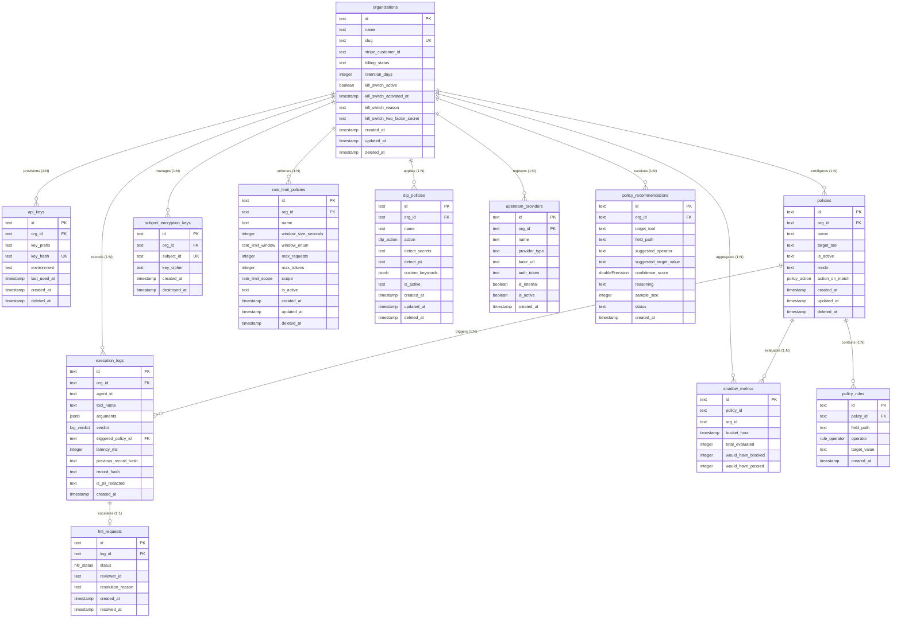

# X4G4T: Database Schema & Data Architecture Specification

This document provides the definitive architectural specification for the **X4G4T relational database schema**, implemented using **Drizzle ORM** on **PostgreSQL 15+**.

---

## Table of Contents
1. [Entity-Relationship Diagram (ERD)](#1-entity-relationship-diagram-erd)
2. [PostgreSQL Custom Enums](#2-postgresql-custom-enums)
3. [Table Specifications & Data Dictionaries](#3-table-specifications--data-dictionaries)
   - [1. `organizations`](#1-organizations)
   - [2. `api_keys`](#2-api_keys)
   - [3. `policies`](#3-policies)
   - [4. `policy_rules`](#4-policy_rules)
   - [5. `execution_logs`](#5-execution_logs)
   - [6. `hitl_requests`](#6-hitl_requests)
   - [7. `subject_encryption_keys`](#7-subject_encryption_keys)
   - [8. `rate_limit_policies`](#8-rate_limit_policies)
   - [9. `dlp_policies`](#9-dlp_policies)
   - [10. `upstream_providers`](#10-upstream_providers)
   - [11. `policy_recommendations`](#11-policy_recommendations)
   - [12. `shadow_metrics`](#12-shadow_metrics)
4. [Indexes & Performance Optimizations](#4-indexes--performance-optimizations)
5. [Foreign Key Constraints & Cascade Semantics](#5-foreign-key-constraints--cascade-semantics)
6. [Regulatory & Cryptographic Compliance Architecture](#6-regulatory--cryptographic-compliance-architecture)
   - [ISO/IEC 27001 Tamper-Evident Hash Chaining](#isoiec-27001-tamper-evident-hash-chaining)
   - [GDPR Art. 17 & DPDP Sec. 12 Crypto-Shredding Registry](#gdpr-art-17--dpdp-sec-12-crypto-shredding-registry)
   - [Data Minimization & Automated Retention Windows](#data-minimization--automated-retention-windows)
7. [Drizzle ORM Relational Mapping](#7-drizzle-orm-relational-mapping)
8. [Migration & Zero-Downtime Evolution Guidelines](#8-migration--zero-downtime-evolution-guidelines)

---

## 1. Entity-Relationship Diagram (ERD)



---

## 2. PostgreSQL Custom Enums

X4G4T uses strict PostgreSQL enum types (`pgEnum`) to prevent invalid state persistence and guarantee type safety at the database engine level.

### `policy_action`
Defines the terminal action triggered when a policy's rules are satisfied:
- `ALLOW`: The tool call is explicitly allowed to proceed.
- `BLOCK`: The tool call is rejected immediately with HTTP 422 `POLICY_VIOLATION`.
- `REQUIRE_APPROVAL`: The tool call is suspended with HTTP 202 `HELD`, dispatching a Slack HITL card.

### `rule_operator`
Defines comparison operators executed by the in-memory AST evaluator:
- `EQUALS`: Strict string, number, or boolean equality.
- `NOT_EQUALS`: Inverted equality.
- `GREATER_THAN`: Numeric greater than (`>`).
- `LESS_THAN`: Numeric less than (`<`).
- `GREATER_THAN_OR_EQUAL`: Numeric greater than or equal (`>=`).
- `LESS_THAN_OR_EQUAL`: Numeric less than or equal (`<=`).
- `CONTAINS`: String substring search.
- `REGEX`: Regular expression pattern matching (supports PCRE `(?i)` and flags).
- `IN`: Set inclusion against a comma-delimited list.

### `log_verdict`
The operational outcome of a tool execution:
- `PASSED`: Compliant execution forwarded downstream.
- `BLOCKED`: Denied by policy guardrails.
- `HELD`: Suspended awaiting human review.

### `hitl_status`
The lifecycle state of a Human-in-the-Loop request:
- `PENDING`: Awaiting human review in Slack or dashboard.
- `APPROVED`: Operator authorized execution.
- `REJECTED`: Operator declined execution.

---

## 3. Table Specifications & Data Dictionaries

### 1. `organizations`
Represents an isolated enterprise customer tenant and root of all relational scoping.

| Column Name | SQL Type | Nullable | Default | Constraints | Description |
| :--- | :--- | :---: | :---: | :--- | :--- |
| `id` | `text` | No | `randomUUID()` | `PRIMARY KEY` | Unique tenant UUID. |
| `name` | `text` | No | — | — | Enterprise display name (e.g. "Acme Corp"). |
| `slug` | `text` | No | — | `UNIQUE` | URL-friendly unique identifier. |
| `stripe_customer_id` | `text` | Yes | `NULL` | — | External billing customer identifier. |
| `billing_status` | `text` | No | `'active'` | — | Status of tenant account. |
| `retention_days` | `integer` | No | `90` | — | **GDPR Art. 5(1)(e)** log retention window in days. |
| `kill_switch_active` | `boolean` | No | `false` | — | Bilateral emergency air-gap severance toggle. |
| `kill_switch_activated_at` | `timestamptz`| Yes | `NULL` | — | Timestamp of emergency air-gap severance. |
| `kill_switch_reason` | `text` | Yes | `NULL` | — | Super Admin justification for air-gap severance. |
| `kill_switch_two_factor_secret` | `text` | Yes | `NULL` | — | Encrypted RFC 6238 TOTP seed secret for 2FA verification. |
| `created_at` | `timestamptz`| No | `NOW()` | — | Tenant creation timestamp. |
| `updated_at` | `timestamptz`| No | `NOW()` | — | Last update timestamp. |
| `deleted_at` | `timestamptz`| Yes | `NULL` | — | Soft-deletion timestamp. |

---

### 2. `api_keys`
Stores cryptographically hashed API tokens used to authenticate AI agents and proxy gateways.

| Column Name | SQL Type | Nullable | Default | Constraints | Description |
| :--- | :--- | :---: | :---: | :--- | :--- |
| `id` | `text` | No | `randomUUID()` | `PRIMARY KEY` | Unique key record UUID. |
| `org_id` | `text` | No | — | `FOREIGN KEY` $\rightarrow$ `organizations.id` | Scoped organization tenant. |
| `key_prefix` | `text` | No | — | — | Unhashed prefix for identification (e.g. `sec_live_9a1b`). |
| `key_hash` | `text` | No | — | `UNIQUE` | **SHA-256 hash** of raw token. Raw token is never stored. |
| `environment` | `text` | No | `'production'`| — | Deployment environment (`production`, `staging`, `dev`). |
| `last_used_at`| `timestamptz`| Yes | `NULL` | — | Timestamp of most recent tool invocation. |
| `created_at` | `timestamptz`| No | `NOW()` | — | Key creation timestamp. |
| `deleted_at` | `timestamptz`| Yes | `NULL` | — | Revocation timestamp (non-null indicates revoked key). |

---

### 3. `policies`
Defines tool-targeting guardrail containers configured by SecOps administrators.

| Column Name | SQL Type | Nullable | Default | Constraints | Description |
| :--- | :--- | :---: | :---: | :--- | :--- |
| `id` | `text` | No | `randomUUID()` | `PRIMARY KEY` | Unique policy UUID. |
| `org_id` | `text` | No | — | `FOREIGN KEY` $\rightarrow$ `organizations.id` | Scoped organization tenant. |
| `name` | `text` | No | — | — | Human-readable policy label. |
| `target_tool` | `text` | No | — | — | Exact tool name (e.g. `issue_refund`) or `*` for all tools. |
| `is_active` | `text` | No | `'true'` | — | Active status flag (`'true'` or `'false'`). |
| `mode` | `text` | No | `'ACTIVE'` | — | Operational mode: `'ACTIVE'`, `'SHADOW_LEARN'`, or `'DISABLED'`. |
| `action_on_match` | `policy_action`| No | `'BLOCK'` | — | Action triggered when all rules match (`ALLOW`, `BLOCK`, `REQUIRE_APPROVAL`). |
| `created_at` | `timestamptz`| No | `NOW()` | — | Creation timestamp. |
| `updated_at` | `timestamptz`| No | `NOW()` | — | Last update timestamp. |
| `deleted_at` | `timestamptz`| Yes | `NULL` | — | Soft-deletion timestamp. |

---

### 4. `policy_rules`
Field-level AST constraints evaluated under strict **AND-semantics** within a policy.

| Column Name | SQL Type | Nullable | Default | Constraints | Description |
| :--- | :--- | :---: | :---: | :--- | :--- |
| `id` | `text` | No | `randomUUID()` | `PRIMARY KEY` | Unique rule UUID. |
| `policy_id` | `text` | No | — | `FOREIGN KEY` $\rightarrow$ `policies.id` | Parent policy identifier. |
| `field_path` | `text` | No | — | — | Dot-path to argument field (e.g. `amount`, `transaction.total`). |
| `operator` | `rule_operator`| No | — | — | Comparison operator (`EQUALS`, `GREATER_THAN`, `REGEX`, etc.). |
| `target_value`| `text` | No | — | — | Static comparison threshold or regex pattern. |
| `created_at` | `timestamptz`| No | `NOW()` | — | Rule creation timestamp. |

---

### 5. `execution_logs`
Immutable, append-only execution ledger equipped with **ISO 27001 cryptographic hash chains**.

| Column Name | SQL Type | Nullable | Default | Constraints | Description |
| :--- | :--- | :---: | :---: | :--- | :--- |
| `id` | `text` | No | `randomUUID()` | `PRIMARY KEY` | Unique log entry UUID. |
| `org_id` | `text` | No | — | `FOREIGN KEY` $\rightarrow$ `organizations.id` | Scoped organization tenant. |
| `agent_id` | `text` | No | — | — | Caller agent identifier (e.g. `customer_support_bot`). |
| `tool_name` | `text` | No | — | — | Tool invoked by the agent. |
| `arguments` | `jsonb` | No | — | — | Sanitized/encrypted tool argument payload. |
| `verdict` | `log_verdict`| No | — | — | Evaluator decision (`PASSED`, `BLOCKED`, `HELD`). |
| `triggered_policy_id` | `text` | Yes | `NULL` | `FOREIGN KEY` $\rightarrow$ `policies.id` | Policy that triggered the verdict (if any). |
| `latency_ms` | `integer` | No | — | — | Hot-path evaluation latency in milliseconds. |
| `previous_record_hash`| `text` | Yes | `NULL` | — | **ISO 27001 A.8.15:** SHA-256 hash of previous record. |
| `record_hash` | `text` | Yes | `NULL` | — | **ISO 27001 A.8.15:** Deterministic SHA-256 hash of this record. |
| `is_pii_redacted`| `text` | No | `'true'` | — | **GDPR Art. 25:** Flag confirming in-flight PII redaction. |
| `created_at` | `timestamptz`| No | `NOW()` | — | Immutable execution timestamp. |

---

### 6. `hitl_requests`
Stateful Human-in-the-Loop approval requests triggered by `REQUIRE_APPROVAL` verdicts.

| Column Name | SQL Type | Nullable | Default | Constraints | Description |
| :--- | :--- | :---: | :---: | :--- | :--- |
| `id` | `text` | No | `randomUUID()` | `PRIMARY KEY` | Unique hold request UUID (`hold_id`). |
| `log_id` | `text` | No | — | `FOREIGN KEY` $\rightarrow$ `execution_logs.id` | Associated execution log entry. |
| `status` | `hitl_status`| No | `'PENDING'` | — | Review state (`PENDING`, `APPROVED`, `REJECTED`). |
| `reviewer_id` | `text` | Yes | `NULL` | — | Slack user ID or dashboard operator identity. |
| `resolution_reason`| `text` | Yes | `NULL` | — | Optional operator comment upon resolution. |
| `created_at` | `timestamptz`| No | `NOW()` | — | Suspension timestamp. |
| `resolved_at`| `timestamptz`| Yes | `NULL` | — | Timestamp of operator resolution. |

---

### 7. `subject_encryption_keys`
Registry of ephemeral symmetric encryption keys enabling **GDPR Art. 17 / DPDP Sec. 12 Crypto-Shredding**.

| Column Name | SQL Type | Nullable | Default | Constraints | Description |
| :--- | :--- | :---: | :---: | :--- | :--- |
| `id` | `text` | No | `randomUUID()` | `PRIMARY KEY` | Unique key record UUID. |
| `org_id` | `text` | No | — | `FOREIGN KEY` $\rightarrow$ `organizations.id` | Scoped organization tenant. |
| `subject_id` | `text` | No | — | — | Data principal identity identifier or hash. |
| `key_cipher` | `text` | No | — | — | Master-key / KMS encrypted AES-256-GCM subject key. |
| `created_at` | `timestamptz`| No | `NOW()` | — | Key creation timestamp. |
| `destroyed_at`| `timestamptz`| Yes | `NULL` | — | Timestamp when key was shredded upon erasure request. |

---

### 8. `rate_limit_policies`
Sliding and fixed window rate limits enforcing request volume and token consumption caps.

| Column Name | SQL Type | Nullable | Default | Constraints | Description |
| :--- | :--- | :---: | :---: | :--- | :--- |
| `id` | `text` | No | `randomUUID()` | `PRIMARY KEY` | Unique rate limit policy UUID. |
| `org_id` | `text` | No | — | `FOREIGN KEY` $\rightarrow$ `organizations.id` | Scoped organization tenant. |
| `name` | `text` | No | — | — | Human-readable quota identifier. |
| `window_size_seconds` | `integer` | No | — | — | Time window in seconds (e.g. 3600 for 1h). |
| `window_enum` | `rate_limit_window` | No | `'1_HOUR'` | — | Standardized window duration enum. |
| `max_requests` | `integer` | No | — | — | Max allowed requests per window. |
| `max_tokens` | `integer` | Yes | `NULL` | — | Optional token consumption ceiling per window. |
| `scope` | `rate_limit_scope` | No | `'PER_USER'` | — | Quota enforcement level (`PER_USER`, `PER_IP`, `PER_ORG`). |
| `is_active` | `text` | No | `'true'` | — | Active status flag. |
| `created_at` | `timestamptz`| No | `NOW()` | — | Creation timestamp. |
| `updated_at` | `timestamptz`| No | `NOW()` | — | Last update timestamp. |
| `deleted_at` | `timestamptz`| Yes | `NULL` | — | Soft-deletion timestamp. |

---

### 9. `dlp_policies`
Data Leakage Prevention rules scanning payloads in-flight for PII, high-entropy secrets, and keywords.

| Column Name | SQL Type | Nullable | Default | Constraints | Description |
| :--- | :--- | :---: | :---: | :--- | :--- |
| `id` | `text` | No | `randomUUID()` | `PRIMARY KEY` | Unique DLP policy UUID. |
| `org_id` | `text` | No | — | `FOREIGN KEY` $\rightarrow$ `organizations.id` | Scoped organization tenant. |
| `name` | `text` | No | — | — | Human-readable DLP rule identifier. |
| `action` | `dlp_action` | No | `'REDACT'` | — | Enforcement action (`BLOCK`, `REDACT`, `ALERT_ONLY`). |
| `detect_secrets` | `text` | No | `'true'` | — | Enable regex/entropy detection for API keys, AWS creds, JWTs. |
| `detect_pii` | `text` | No | `'true'` | — | Enable detection for SSN, Aadhaar, Credit Cards, Emails, Phones. |
| `custom_keywords` | `jsonb` | No | `'[]'` | — | Tenant-specific keyword and pattern blacklist. |
| `is_active` | `text` | No | `'true'` | — | Active status flag. |
| `created_at` | `timestamptz`| No | `NOW()` | — | Creation timestamp. |
| `updated_at` | `timestamptz`| No | `NOW()` | — | Last update timestamp. |
| `deleted_at` | `timestamptz`| Yes | `NULL` | — | Soft-deletion timestamp. |

---

### 10. `upstream_providers`
Custom and on-premises inference endpoints (Ollama clusters, vLLM nodes, TGI, LocalAI).

| Column Name | SQL Type | Nullable | Default | Constraints | Description |
| :--- | :--- | :---: | :---: | :--- | :--- |
| `id` | `text` | No | `randomUUID()` | `PRIMARY KEY` | Unique provider UUID. |
| `org_id` | `text` | No | — | `FOREIGN KEY` $\rightarrow$ `organizations.id` | Scoped organization tenant. |
| `name` | `text` | No | — | — | Human-readable endpoint label (e.g. "Local Ollama Cluster"). |
| `provider_type` | `text` | No | — | — | Runtime type (`OLLAMA`, `OPENAI_COMPATIBLE`, `ANTHROPIC`, `CUSTOM`). |
| `base_url` | `text` | No | — | — | Reachable internal URL (e.g. `http://ollama:11434`). |
| `auth_token` | `text` | Yes | `NULL` | — | Optional internal bearer token or auth header. |
| `is_internal` | `boolean` | No | `true` | — | Flag denoting private VPC or sovereign network location. |
| `is_active` | `boolean` | No | `true` | — | Availability status of provider endpoint. |
| `created_at` | `timestamptz`| No | `NOW()` | — | Creation timestamp. |

---

### 11. `policy_recommendations`
ML-synthesized policy candidates mined out-of-band by the decoupled Intelligence Plane.

| Column Name | SQL Type | Nullable | Default | Constraints | Description |
| :--- | :--- | :---: | :---: | :--- | :--- |
| `id` | `text` | No | `randomUUID()` | `PRIMARY KEY` | Unique recommendation UUID. |
| `org_id` | `text` | No | — | `FOREIGN KEY` $\rightarrow$ `organizations.id` | Scoped organization tenant. |
| `target_tool` | `text` | No | — | — | Mined tool name (e.g. `issue_refund`). |
| `field_path` | `text` | No | — | — | Argument parameter path (e.g. `amount`). |
| `suggested_operator` | `text` | No | — | — | Suggested comparison (`LESS_THAN_OR_EQUAL`, `IN`). |
| `suggested_target_value` | `text` | No | — | — | Synthesized threshold (e.g. `200`). |
| `confidence_score` | `doublePrecision` | No | — | — | Statistical confidence score ($0.0 \dots 1.0$). |
| `reasoning` | `text` | No | — | — | Mathematical derivation and quantile rationale. |
| `sample_size` | `integer` | No | — | — | Number of historical logs evaluated in sample. |
| `status` | `text` | No | `'PENDING'` | — | Review status (`PENDING`, `ACCEPTED`, `DISMISSED`). |
| `created_at` | `timestamptz`| No | `NOW()` | — | Recommendation timestamp. |

---

### 12. `shadow_metrics`
Hourly rollups storing counterfactual evaluation telemetry for draft policies in `SHADOW_LEARN` mode.

| Column Name | SQL Type | Nullable | Default | Constraints | Description |
| :--- | :--- | :---: | :---: | :--- | :--- |
| `id` | `text` | No | `randomUUID()` | `PRIMARY KEY` | Unique rollup record UUID. |
| `policy_id` | `text` | No | — | — | Target shadow policy identifier. |
| `org_id` | `text` | No | — | — | Scoped organization tenant. |
| `bucket_hour` | `timestamptz`| No | — | — | Hourly aggregation bucket timestamp. |
| `total_evaluated` | `integer` | No | `0` | — | Total tool calls evaluated against shadow policy. |
| `would_have_blocked`| `integer` | No | `0` | — | Total calls that matched blocking rules. |
| `would_have_passed` | `integer` | No | `0` | — | Total calls that passed rules. |

---

## 4. Indexes & Performance Optimizations

To guarantee $<15\text{ms}$ end-to-end proxy latency and sub-second dashboard query performance, the following strategic indexes are maintained:

| Index Name | Table | Indexed Columns | Index Type | Optimization Target |
| :--- | :--- | :--- | :--- | :--- |
| `api_keys_hash_idx` | `api_keys` | `key_hash` | `UNIQUE B-TREE` | O(1) Bearer token authentication lookup. |
| `api_keys_org_id_idx` | `api_keys` | `org_id` | `B-TREE` | Scoped key listing in the web dashboard. |
| `policies_org_tool_idx`| `policies` | `org_id`, `target_tool` | `COMPOSITE B-TREE` | Instant retrieval of active policies for a targeted tool. |
| `policy_rules_policy_id_idx` | `policy_rules` | `policy_id` | `B-TREE` | Relational join when compiling policy ASTs. |
| `exec_logs_org_created_idx` | `execution_logs` | `org_id`, `created_at DESC` | `COMPOSITE B-TREE` | Real-time 4-second dashboard log streaming and retention purging. |
| `hitl_requests_status_idx` | `hitl_requests` | `status` | `B-TREE` | Fast retrieval of pending approval queues. |
| `subject_keys_org_subject_idx` | `subject_encryption_keys` | `org_id`, `subject_id` | `UNIQUE COMPOSITE` | Fast subject key retrieval and atomic erasure. |
| `rate_limit_org_idx` | `rate_limit_policies` | `org_id` | `B-TREE` | Organization quota lookup. |
| `dlp_policies_org_idx` | `dlp_policies` | `org_id` | `B-TREE` | Organization DLP pipeline initialization. |
| `providers_org_idx` | `upstream_providers` | `org_id` | `B-TREE` | Upstream provider endpoint resolution. |
| `recommendations_org_status_idx` | `policy_recommendations` | `org_id`, `status` | `COMPOSITE B-TREE` | Unreviewed recommendation triage. |
| `shadow_metrics_policy_bucket_idx`| `shadow_metrics` | `policy_id`, `bucket_hour` | `COMPOSITE B-TREE` | Time-series charting of shadow mode drift. |

---

## 5. Foreign Key Constraints & Cascade Semantics

| Source Table | Foreign Key Column | Target Table & Column | On Delete Action | Rationale |
| :--- | :--- | :--- | :--- | :--- |
| `api_keys` | `org_id` | `organizations.id` | `CASCADE` | Purges all credentials upon tenant deletion. |
| `policies` | `org_id` | `organizations.id` | `CASCADE` | Removes organizational policy rules upon tenant offboarding. |
| `policy_rules` | `policy_id` | `policies.id` | `CASCADE` | Deleting a policy removes all constituent field rules. |
| `execution_logs`| `org_id` | `organizations.id` | `CASCADE` | Tenant lifecycle scoping. |
| `execution_logs`| `triggered_policy_id`| `policies.id` | `SET NULL` | **Audit Preservation:** Deleting a policy preserves historical execution logs. |
| `hitl_requests` | `log_id` | `execution_logs.id` | `CASCADE` | Hold requests are tied directly to their execution log entry. |
| `subject_encryption_keys` | `org_id` | `organizations.id` | `CASCADE` | Tenant lifecycle scoping. |
| `rate_limit_policies` | `org_id` | `organizations.id` | `CASCADE` | Purges tenant rate limits upon account deletion. |
| `dlp_policies` | `org_id` | `organizations.id` | `CASCADE` | Purges tenant DLP configurations upon account deletion. |
| `upstream_providers` | `org_id` | `organizations.id` | `CASCADE` | Purges custom upstream endpoints upon account deletion. |
| `policy_recommendations` | `org_id` | `organizations.id` | `CASCADE` | Purges ML recommendations upon account deletion. |

---

## 6. Regulatory & Cryptographic Compliance Architecture

### ISO/IEC 27001 Tamper-Evident Hash Chaining
In compliance with **ISO/IEC 27001:2022 Control A.8.15 (Logging and Monitoring)**, rows in `execution_logs` are cryptographically linked sequentially via SHA-256:

$$\text{record\_hash}_i = \text{SHA-256}\left( \text{id}_i \parallel \text{previous\_record\_hash}_i \parallel \text{tool\_name}_i \parallel \text{verdict}_i \parallel \text{created\_at}_i \right)$$

- Where $\text{previous\_record\_hash}_0 = \text{"GENESIS\_BLOCK"}$.
- Any unauthorized direct database update to `arguments`, `verdict`, or `tool_name` permanently breaks the cryptographic verification chain:
  $$\text{record\_hash}_{i+1}.\text{previous\_record\_hash} \ne \text{SHA-256}(\dots)$$

---

### GDPR Art. 17 & DPDP Sec. 12 Crypto-Shredding Registry
To solve the conflict between **ISO 27001 immutability** and **GDPR Right to Erasure**:
1. When personal data is stored in `execution_logs.arguments`, it is encrypted with an ephemeral AES-256-GCM key stored in `subject_encryption_keys.key_cipher`.
2. Upon an erasure request, the row in `subject_encryption_keys` has its `key_cipher` overwritten with cryptographic noise and `destroyed_at` is set.
3. **Mathematical Erasure:** Without the key, the ciphertext in `execution_logs` is permanently unrecoverable, satisfying EU EDPB erasure standards while keeping the append-only SHA-256 hash chain intact.

---

### Data Minimization & Automated Retention Windows
Under **GDPR Art. 5(1)(e)** and **India DPDP Act Sec. 8(7)**:
- Each organization configures `retention_days` (default: 90 days).
- A scheduled worker queries `exec_logs_org_created_idx` to purge expired records outside the compliance window:
  ```sql
  DELETE FROM execution_logs 
  WHERE org_id = $1 
    AND created_at < NOW() - (retention_days || ' days')::interval;
  ```

---

## 7. Drizzle ORM Relational Mapping

In TypeScript, relations are defined cleanly using Drizzle's `relations()` API:

```typescript
export const organizationsRelations = relations(organizations, ({ many }) => ({
  apiKeys: many(apiKeys),
  policies: many(policies),
  executionLogs: many(executionLogs),
  subjectEncryptionKeys: many(subjectEncryptionKeys),
  rateLimitPolicies: many(rateLimitPolicies),
  dlpPolicies: many(dlpPolicies),
  upstreamProviders: many(upstreamProviders),
  policyRecommendations: many(policyRecommendations),
  shadowMetrics: many(shadowMetrics)
}));

export const policiesRelations = relations(policies, ({ one, many }) => ({
  organization: one(organizations, {
    fields: [policies.orgId],
    references: [organizations.id]
  }),
  rules: many(policyRules),
  executionLogs: many(executionLogs)
}));

export const executionLogsRelations = relations(executionLogs, ({ one, many }) => ({
  organization: one(organizations, {
    fields: [executionLogs.orgId],
    references: [organizations.id]
  }),
  policy: one(policies, {
    fields: [executionLogs.triggeredPolicyId],
    references: [policies.id]
  }),
  hitlRequests: many(hitlRequests)
}));
```

---

## 8. Migration & Zero-Downtime Evolution Guidelines

1. **Reversible Migrations:** All schema changes must be generated via `drizzle-kit generate:pg` and accompanied by an explicit down-migration or rollback script.
2. **Non-Blocking Column Additions:** New columns must always be `NULLABLE` or define a `DEFAULT` value to allow zero-downtime rolling deployments across proxy instances.
3. **Zero Hot-Path Database Locks:** Avoid `ALTER TABLE ... ALTER COLUMN` operations that acquire exclusive table locks during peak production traffic.

