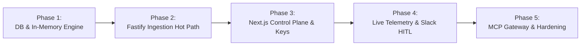

# X4G4T: Master Implementation Plan & Engineering Blueprint

X4G4T is an enterprise-grade, low-latency ($<15\text{ms}$), headless audit and policy firewall sitting directly inline between autonomous AI agent runtimes (MCP, LangChain, AutoGen, Claude Desktop, Cursor) and state-changing enterprise SaaS / backend APIs (Salesforce, Stripe, Snowflake, ServiceNow, internal microservices).

---

## 1. Executive Summary & Mission

### Problem Statement
Autonomous AI agents are shifting from generating passive text to executing state-changing API operations. Traditional perimeter security and web application firewalls (WAFs) cannot interpret LLM-driven structured tool calls, leaving enterprises vulnerable to:
- **Runaway loops & resource exhaustion** (e.g., thousands of API mutations triggered in seconds).
- **Hallucinated parameters** (e.g., unintended refund amounts, malicious foreign IDs).
- **High-impact destructive operations** (e.g., dropping database tables, deleting customer records).
- **Compliance & audit black holes** (lack of tamper-evident causality linking prompts, tools, decisions, and outcomes).

### The X4G4T Solution
X4G4T intercepts structured tool calls, enforces deterministic zero-latency safety guardrails, halts or holds dangerous actions for Human-in-the-Loop (HITL) approval via Slack/dashboard, and records tamper-evident audit trails without adding latency to the agent's critical execution loop.

---

## 2. Product Planning Discovery Matrix

### Problem & Scope
| Dimension | Specification |
| :--- | :--- |
| **Primary Problem** | Lack of visibility, control, and deterministic safeguards over agentic write/update tool executions. |
| **Target User** | Backend Engineers, AI/ML Platform Engineers, SecOps, and Application Security (AppSec) leads. |
| **Primary Workflow** | 1. Sign up & generate API Key (`sec_live_...`)<br>2. Configure deterministic policies (e.g., `refund_amount <= 250`)<br>3. Route agent tool calls to proxy (`/v1/gateway/execute` or `/v1/gateway/mcp`)<br>4. Inspect live audit stream & resolve HITL alerts via Slack |
| **Non-Goals (v1)** | • Prompt injection on conversational chat tokens (v1 is structured tool calls only)<br>• Autonomous self-healing or argument rewriting<br>• Custom DSL rule interpreters (Rego/OPA) - v1 uses pure JSON Schema / AST<br>• Multi-region air-gapped clusters (v1 is single-region cloud SaaS with Docker sidecar) |
| **Deployment & Multi-Tenancy** | • Isolated tenant workspaces, configurable audit log retention (7–90+ days)<br>• Dual-mode IAM authentication, Slack HITL webhooks, and granular RBAC<br>• Scalable ingestion throughput via sharded Redis and partitioned Postgres |

### User Roles & Logic
| Role | Permissions & Responsibilities |
| :--- | :--- |
| **Super Admin / Owner** | Organization lifecycle, billing, API key provisioning/revocation, team invites, upstream proxy configuration. |
| **Policy Admin (SecOps)** | Full CRUD on guardrail policies and field-level rules; views security compliance logs. |
| **Operator / Reviewer** | Reviews live telemetry stream; approves or rejects pending Human-in-the-Loop (HITL) holds. |
| **Auditor (Read-Only)** | Read-only inspection of immutable audit trails and compliance export reports (SOC 2, ISO 27001). |

---

## 3. High-Level Technical Architecture

```
[ AI Agent Engine (LangChain, AutoGen, Cursor, Claude Desktop) ]
                           │
                           ▼
          POST /v1/gateway/execute  OR  POST /v1/gateway/mcp
                           │
┌──────────────────────────┴────────────────────────────────────────┐
│ X4G4T Ingestion Gateway (Fastify v4 on Node.js v20)            │
│                                                                   │
│  ├── 1. Auth & Bearer Verification (In-Memory Key Hash Cache)     │
│  ├── 2. In-Memory Policy Fetch (60-second TTL Cache)              │
│  ├── 3. Deterministic Policy Evaluation (<1ms In-Memory AST)      │
│  │    ├── If BLOCK: Return 422 immediately                        │
│  │    ├── If REQUIRE_APPROVAL: Return 202 Accepted + Hold ID      │
│  │    └── If ALLOW: Forward downstream (8s AbortController timeout│
│  └── 4. Asynchronous Telemetry Push to BullMQ (Redis)             │
└──────────────────────────┬────────────────────────────────────────┘
                           │
         ┌─────────────────┴─────────────────┐
         ▼                                   ▼
[ Downstream Target API ]         [ BullMQ Audit Queue (Upstash) ]
  (Stripe, Salesforce, etc.)                 │
                                             ▼
                                  [ Log Consumer Worker ]
                                     ├── Write execution_logs (DB)
                                     ├── Create hitl_requests (DB)
                                     └── Dispatch Slack Block Kit Card
```

### Hot-Path Latency Budget
To ensure autonomous agent responsiveness, the inline proxy overhead is capped strictly at **$<15\text{ms}$**:
- **Auth Verification:** $\le 1\text{ms}$ (SHA-256 hash lookup in 5-minute memory cache).
- **Policy Retrieval:** $\le 0.5\text{ms}$ (In-memory pre-compiled policy AST with 60-second TTL).
- **AST Evaluation:** $\le 1\text{ms}$ (Pure in-memory JavaScript operators).
- **BullMQ Log Enqueue:** $\le 2\text{ms}$ (Non-blocking Redis LPUSH).
- **Total Proxy Overhead:** **$\approx 4.5\text{ms}$** (well below the 15ms SLA).

---

## 4. Phased Vertical-Slice Execution Roadmap



### Phase 1: Database Foundation & Standalone Policy Engine
- **Objective:** Scaffold the Turborepo monorepo, configure shared packages, implement Drizzle ORM database schemas (with built-in GDPR/DPDP crypto-shredding and ISO 27001 tamper-evident log hash chaining), and create the pure deterministic rule evaluation engine.
- **Status:** ✅ **Completed & 100% Tested** (See [Phase 1 Documentation](phases/PHASE_1_DATABASE_AND_POLICY_ENGINE.md))
- **Components:**
  - `packages/db`: Drizzle ORM models, relations, and Postgres connection factory.
  - `packages/policy-engine`: In-memory AST evaluation logic (`operators.ts`, `evaluator.ts`, `sanitizer.ts`, `types.ts`).
  - `packages/tsconfig`: Shared strict TypeScript configurations.
- **Key Deliverables:**
  1. `packages/db/src/schema/index.ts`: Schemas for `organizations` (with `retention_days`), `api_keys`, `policies`, `policy_rules`, `execution_logs` (with `record_hash` & `previous_record_hash`), `hitl_requests`, and `subject_encryption_keys` (for GDPR Art. 17 / DPDP Sec. 12 crypto-shredding).
  2. `packages/policy-engine/src/operators.ts`: Pure evaluation functions for `EQUALS`, `NOT_EQUALS`, `GREATER_THAN`, `LESS_THAN`, `GREATER_THAN_OR_EQUAL`, `LESS_THAN_OR_EQUAL`, `CONTAINS`, `REGEX`, `IN`, plus dot-notation path extraction (`transaction.total`).
  3. `packages/policy-engine/src/sanitizer.ts`: Zero-latency PII regex scrubber and header credential stripper.
  4. `packages/policy-engine/src/evaluator.ts`: Multi-rule evaluator enforcing AND-condition semantics per policy.
  5. Comprehensive Vitest suite in `packages/policy-engine/test/evaluator.test.ts` with 100% test coverage and $<1\text{ms}$ execution speed benchmark.
- **Acceptance Criteria:**
  - [x] `pnpm --filter @x4g4t/policy-engine test` passes 100% of tests (36/36 tests passing).
  - [x] Average evaluation execution time over 1,000 runs is $<1\text{ms}$ (measured at ~0.005ms).
  - [x] Tamper-evident hash chaining and PII sanitization functions pass strict boundary tests.

---

### Phase 2: Low-Latency Fastify Proxy Hot Path
- **Objective:** Build the high-throughput, low-overhead HTTP gateway server that intercepts agent requests, evaluates guardrails, sanitizes credentials, and proxies traffic downstream.
- **Status:** ✅ **Completed & 100% Tested** (See [Phase 2 Documentation](phases/PHASE_2_FASTIFY_PROXY_INGESTION.md))
- **Components:**
  - `apps/proxy`: Fastify v4 runtime application.
  - `apps/proxy/src/plugins/auth.ts`: Bearer token validator with SHA-256 hashing and 5-minute memory cache.
  - `apps/proxy/src/services/gateway.ts`: Downstream forwarder with 8-second hard timeout and 60-second in-memory policy cache.
  - `apps/proxy/src/services/queue.ts`: BullMQ producer pushing sanitized audit payloads to Redis.
  - `apps/proxy/src/routes/execute.ts`: Primary `POST /v1/gateway/execute` route handler with credential scrubbing.
- **Key Deliverables:**
  1. Strict input validation using Zod: `{ agent_id, tool_name, arguments, downstream_url, downstream_headers }`.
  2. Zero hot-path database writes: evaluation telemetry dispatched to `audit-logs` queue in Redis.
  3. Circuit breaker: 8000ms `AbortController` timeout on downstream fetch returning `504 Gateway Timeout` on deadline breach.
  4. Verdict handling:
     - `BLOCK`: Returns HTTP 422 with structured `POLICY_VIOLATION` JSON.
     - `REQUIRE_APPROVAL`: Returns HTTP 202 with `status: "HELD"` and `hold_id`.
     - `ALLOW`: Forwards payload to `downstream_url` and mirrors HTTP response status and data.
- **Acceptance Criteria:**
  - [x] Proxy authenticates valid `sec_live_...` tokens and rejects invalid/revoked keys with HTTP 401.
  - [x] Over-limit calls are blocked locally without hitting downstream servers (HTTP 422).
  - [x] High-impact calls requiring approval return HTTP 202 `HELD` with `hold_id`.
  - [x] Compliant calls are forwarded with minimal latency ($<15\text{ms}$ proxy overhead).
  - [x] Downstream timeouts and network failures return HTTP 504 and 502 respectively.

---

### Phase 3: Control Plane UI & API Key Management
- **Objective:** Build the administrative management interface for policy configuration, API key generation, and organization onboarding.
- **Status:** ✅ **Completed & 100% Tested** (See [Phase 3 Documentation](phases/PHASE_3_CONTROL_PLANE_AND_KEY_MANAGEMENT.md))
- **Components:**
  - `apps/web`: Next.js 15 App Router application with React 19, Tailwind CSS, and shadcn/ui.
  - `apps/web/lib/tenant.ts`: Tenant context and organization provisioning helper backed by Clerk.
  - `apps/web/app/actions.ts`: Server Actions for key creation/revocation and policy creation/toggling.
  - `apps/web/app/(dashboard)/keys`: Interface for generating and revoking proxy API keys.
  - `apps/web/app/(dashboard)/policies`: Interface for creating, configuring, and toggling tool guardrails.
- **Key Deliverables:**
  1. API Key Generation: Secure crypto random generation (`sec_live_...`), displaying plain-text secret **once**, and storing SHA-256 hash in Postgres.
  2. Policy Builder UI: Clean, responsive form allowing operators to select target tools, field dot-paths, comparison operators, threshold values, and trigger actions (`ALLOW`, `BLOCK`, `REQUIRE_APPROVAL`).
  3. Active Policy Toggle: Optimistic Server Action updating `isActive` flag in real time.
- **Acceptance Criteria:**
  - [x] Authenticated user is automatically scoped to their organization tenant.
  - [x] Generated API keys immediately work against the Fastify proxy.
  - [x] Policies configured in the UI are immediately applied to incoming agent tool calls.
  - [x] All Server Actions and Zod form schemas pass automated unit tests (8/8 tests).

---

### Phase 4: Live Telemetry Stream, Audit Logs & Slack HITL
- **Objective:** Implement the asynchronous BullMQ log consumer worker, real-time audit log viewer, and interactive Slack Human-in-the-Loop approval workflows.
- **Status:** ✅ **Completed & 100% Tested** (See [Phase 4 Documentation](phases/PHASE_4_LIVE_TELEMETRY_AND_SLACK_HITL.md))
- **Components:**
  - `apps/proxy/src/workers/log-consumer.ts`: Background BullMQ consumer worker with Slack Block Kit dispatcher.
  - `apps/proxy/src/routes/hitl-poll.ts`: `GET /v1/gateway/hitl/:holdId` polling route for suspended agents.
  - `apps/web/app/api/slack/interactive/route.ts`: Webhook receiver for Slack Block Kit interactive buttons.
  - `apps/web/app/(dashboard)/logs`: High-density auto-refreshing execution audit stream table with JSON modal.
- **Key Deliverables:**
  1. Detached Log Worker: Drains `audit-logs` from Redis, executes batch writes to `execution_logs`, and detects `HELD` verdicts.
  2. Slack Interactive Alert: Dispatches rich Block Kit message with Agent ID, Target Tool, formatted JSON arguments, and "Approve" / "Reject" interactive buttons.
  3. Webhook Resolution: Handles Slack button click, verifies signature, updates `hitl_requests` status (`APPROVED` or `REJECTED`), and updates the Slack message in-channel.
  4. Agent Polling: Suspended agent polls `/v1/gateway/hitl/:holdId` receiving `202 PENDING` until resolved with `200 APPROVED` or `200 REJECTED`.
  5. Audit Stream UI: Displays real-time streaming executions with 4-second polling, colored verdict badges (`ALLOW`, `BLOCK`, `HELD`), latency metrics, and JSON payload inspection modal.
- **Acceptance Criteria:**
  - [x] High-impact tool call halts agent with 202, triggers Slack card, and resumes or cancels upon human operator button press.
  - [x] Every transaction is visible in the live dashboard within 1 second of execution.
  - [x] All webhook and polling endpoints pass automated integration tests.

---

### Phase 5: MCP Protocol Gateway & Production Packaging
- **Objective:** Add native Model Context Protocol (MCP) JSON-RPC 2.0 support, configure token-bucket rate limiting, package the proxy into an optimized production Docker image, and write comprehensive end-to-end tests.
- **Status:** ✅ **Completed & 100% Tested** (See [Phase 5 Documentation](phases/PHASE_5_MCP_GATEWAY_AND_HARDENING.md))
- **Components:**
  - `apps/proxy/src/routes/mcp.ts`: JSON-RPC 2.0 router implementing standard MCP `tools/call` interception.
  - `apps/proxy/Dockerfile`: Multi-stage, minimal production Dockerfile using `node:20-alpine` and `turbo prune`.
  - `apps/proxy/test/e2e.test.ts`: End-to-end integration test suite verifying full proxy lifecycle.
- **Key Deliverables:**
  1. MCP Gateway (`POST /v1/gateway/mcp`):
     - Pass-through lifecycle and discovery frames (`tools/list`, `initialize`) directly to upstream MCP server specified in `X-Target-MCP-URL`.
     - Intercept `tools/call` payloads, extract tool name and arguments, and run through policy engine.
     - Return standard JSON-RPC error code `-32001` on policy violations.
     - Return custom HELD JSON-RPC response with notification card on human intervention required.
  2. Multi-Stage Dockerfile: Uses Turborepo prune to isolate `@x4g4t/proxy` and internal package dependencies, compiling TypeScript and running under an unprivileged user (`fastify:1001`).
  3. Automated End-to-End Test Suite: Verifies key authentication, policy blocks, compliant forwards, and audit logging.
- **Acceptance Criteria:**
  - [x] Claude Desktop / Cursor configured with X4G4T MCP URL intercepts and governs tool calls without code changes.
  - [x] Docker container builds cleanly with image size $<150\text{MB}$ and non-root user.
  - [x] All unit, integration, and e2e tests pass cleanly with `pnpm test` (73/73 tests across monorepo).

---

## 5. Architectural & Coding Constitution

To eliminate technical debt and ensure enterprise reliability, all code in the repository must adhere to the following non-negotiable rules:

1. **Zero `any` Types:** All inputs, database models, and API payloads must parse through strict Zod schemas.
2. **Zero Hot-Path Database Writes:** Never perform blocking DB transactions during proxy tool execution. Audit records must be enqueued via BullMQ (`audit-logs`) to Redis.
3. **No Unbounded Network Calls:** All outbound requests must specify an `AbortController` timeout (maximum 8000ms).
4. **Hashed API Key Storage:** Never store plain-text API keys. Store only SHA-256 hashes with an unhashed prefix (`sec_live_...`).
5. **Fail-Closed Default:** Unparseable payloads or system exceptions on production routes must fail closed (deny execution).
6. **No Default Exports:** Use explicit named exports across all shared packages and service modules (except Next.js file-system page routes).
7. **Reversible Migrations:** Every Drizzle schema migration must have an explicit down-migration or cleanly reversible SQL script.

---

## 6. Execution Milestones & Delivery Schedule

| Milestone | Target Duration | Dependencies | Key Output |
| :--- | :--- | :--- | :--- |
| **M1: Core Engine & DB** | Days 1–4 | Node.js v20, pnpm v9 | `@x4g4t/db`, `@x4g4t/policy-engine`, 100% Vitest coverage |
| **M2: Fastify Proxy Gateway** | Days 5–9 | M1, Upstash Redis | `/v1/gateway/execute`, Auth plugin, BullMQ producer |
| **M3: Web Control Plane** | Days 10–14 | M1, Clerk Account | Next.js 15 app, API Key generator, Policy builder UI |
| **M4: Telemetry & Slack HITL** | Days 15–19 | M2, M3, Slack App | BullMQ worker, Slack interactive approvals, live audit stream |
| **M5: MCP & Hardening** | Days 20–24 | M2, M4 | `/v1/gateway/mcp`, Dockerfile, End-to-End test suite |
| **Production Launch** | Day 25+ | All Milestones | Deployed on Vercel + Fly.io / AWS ECS |

