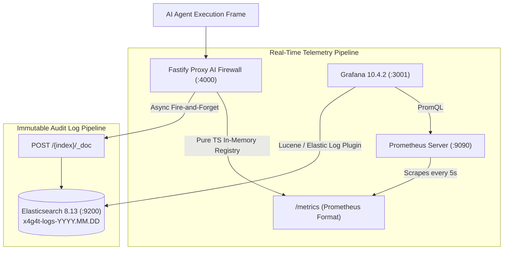

# X4G4T Full Observability & Grafana Provisioning Architecture

X4G4T delivers enterprise-grade, turn-key observability across **metrics, latency histograms, operational health, and immutable audit logs**. It adheres to a strict zero-telemetry-overhead principle: Prometheus metrics are tracked in pure TypeScript counters and histograms without external SDK dependencies, and Elasticsearch audit logs are dispatched asynchronously without blocking the AI agent execution hot path.

---

## 1. Observability Architecture



---

## 2. Complete Metric Dictionary & Taxonomy

Every metric exposed at `GET /metrics` complies with standard Prometheus text exposition format:

### 2.1 Security & Governance Telemetry
| Metric Name | Type | Labels | Description |
| :--- | :--- | :--- | :--- |
| `http_requests_total` | Counter | `method`, `route`, `status`, `verdict` | Total HTTP requests ingested by the gateway, segmented by outcome (`PASSED`, `BLOCKED`, `HELD`, `AI_LOCKDOWN_ACTIVE`, `RATE_LIMITED`). |
| `hitl_requests_total` | Counter | `status` | Total operations placed into human-in-the-loop pending holds (`status="PENDING"`). |
| `x4g4t_global_ai_lockdown_active` | Gauge | None | SecOps emergency kill-switch status (`1` = active lockdown, all executions rejected; `0` = normal operation). |
| `x4g4t_policy_freeze_active` | Gauge | None | Policy configuration immutability state (`1` = frozen, edits rejected; `0` = editable). |

### 2.2 Latency & Performance Percentiles
| Metric Name | Type | Buckets / Labels | Description |
| :--- | :--- | :--- | :--- |
| `http_request_duration_seconds` | Histogram | `[1ms, 5ms, 10ms, 25ms, 50ms, 100ms, 250ms, 500ms, 1s, 2.5s, 5s, 8s]` | Total round-trip execution latency through the gateway. |
| `policy_evaluation_duration_seconds` | Histogram | `[50µs, 100µs, 250µs, 500µs, 1ms, 5ms, 10ms]` / `tool` | In-memory Abstract Syntax Tree (AST) policy evaluation latency (typically <200µs). |
| `downstream_forward_duration_seconds` | Histogram | `[10ms, 50ms, 100ms, 250ms, 500ms, 1s, 2s, 5s, 8s]` / `tool` | Egress latency to target downstream APIs and upstream LLM providers. |

### 2.3 Threat Protection & Data Governance (Gateway Metrics)
| Metric Name | Type | Labels | Description |
| :--- | :--- | :--- | :--- |
| `x4g4t_tokens_injected_total` | Counter | `provider` (`openai`, `anthropic`, `gemini`) | Count of upstream LLM master API keys securely injected at gateway egress. |
| `x4g4t_dlp_redactions_total` | Counter | None | Sensitive PII entities (SSN, Aadhaar, credit cards) and credentials (AWS keys, GitHub tokens, private keys) redacted in-flight. |
| `x4g4t_ssrf_blocked_total` | Counter | None | Total malicious SSRF attempts, loopback exploits, and cloud metadata (`169.254.169.254`) requests blocked. |
| `x4g4t_rate_limit_hits_total` | Counter | `scope` (`PER_USER`, `PER_IP`, `PER_ORG`) | Count of requests throttled by sliding-window rate limit rules. |
| `x4g4t_mcp_requests_total` | Counter | `method`, `verdict` | Total Model Context Protocol JSON-RPC frames processed (`tools/call`, `tools/list`, `initialize`). |
| `x4g4t_payload_size_bytes` | Histogram | `[64B, 256B, 1KB, 4KB, 16KB, 64KB, 256KB]` | Distribution of inbound JSON-RPC and tool payload sizes. |

### 2.4 Infrastructure & Operational Health
| Metric Name | Type | Labels | Description |
| :--- | :--- | :--- | :--- |
| `x4g4t_database_connected` | Gauge | None | PostgreSQL connection status (`1` = healthy, `0` = unreachable). |
| `x4g4t_redis_connected` | Gauge | None | Redis connection status (`1` = healthy, `0` = unreachable). |
| `x4g4t_elasticsearch_errors_total` | Counter | None | Delivery errors encountered when dispatching logs to Elasticsearch. |
| `x4g4t_active_policies_count` | Gauge | `org` | Number of active guardrail policies compiled and cached in memory. |
| `process_uptime_seconds` | Gauge | None | Gateway process uptime in seconds. |
| `process_resident_memory_bytes` | Gauge | None | Resident Set Size (RSS) memory consumption in bytes. |
| `process_heap_used_bytes` | Gauge | None | V8 heap memory consumed in bytes. |

---

## 3. Elasticsearch Tamper-Evident Daily Index Rotation

### 3.1 Daily Index Pattern
Audit records are partitioned daily into UTC-aligned indices to support high-throughput ingestion and automated cold retention lifecycles:

$$\text{Index Name} = \texttt{x4g4t-logs-} \text{YYYY}.\text{MM}.\text{DD}$$

For example:
- `x4g4t-logs-2026.09.22`
- `x4g4t-logs-2026.09.23`

### 3.2 Audit Log Document Schema
Every tool execution produces a structured JSON document:

```json
{
  "@timestamp": "2026-09-22T13:20:00.123Z",
  "orgId": "org_default_x4g4t",
  "agentId": "claude-code-prod",
  "toolName": "transfer_funds",
  "arguments": {
    "account_id": "acc_9921",
    "amount": 25000,
    "email": "a***@corp.internal"
  },
  "verdict": "HELD",
  "triggeredPolicyId": "pol_transfer_guard",
  "latencyMs": 14,
  "statusCode": 202,
  "iam": {
    "userId": "usr_dev_42",
    "roles": ["developer"],
    "groups": ["X4G4T-Developers"]
  }
}
```

> [!NOTE]
> All sensitive PII (Aadhaar, SSN, Credit Cards) and API secrets in `arguments` are scrubbed via `sanitizePayload()` prior to indexing, ensuring GDPR, DPDP, and SOC2 compliance with zero leakage in Elasticsearch.

---

## 4. Grafana Automated Provisioning Pipeline

Grafana boots with zero manual clicks required. Both Docker Compose and Kubernetes utilize the same declarative provisioning files:

```
docker/grafana/
├── provisioning/
│   ├── datasources/
│   │   └── datasources.yml      # Defines Prometheus & Elasticsearch
│   └── dashboards/
│       └── dashboards.yml       # Registers filesystem dashboard provider
└── dashboards/
    └── x4g4t-overview.json   # Full pre-built 17-panel dashboard
```

### 4.1 Datasource Configuration (`datasources.yml`)
```yaml
apiVersion: 1
datasources:
  - name: Prometheus
    type: prometheus
    access: proxy
    url: http://x4g4t-prometheus:9090
    isDefault: true
    editable: true

  - name: Elasticsearch
    type: elasticsearch
    access: proxy
    url: http://x4g4t-elasticsearch:9200
    database: "x4g4t-logs-*"
    editable: true
    jsonData:
      timeField: "@timestamp"
      esVersion: "8.0.0"
      interval: "Daily"
      logMessageField: "toolName"
      logLevelField: "verdict"
```

### 4.2 Dashboard Layout (`x4g4t-overview.json`)

The pre-provisioned dashboard contains **5 distinct rows and 17 visual panels**:

1. **🚨 Security & Governance Controls**:
   - *Global AI Kill-Switch*: Real-time stat badge (`OPERATIONAL` in green vs `LOCKDOWN ACTIVE` in red).
   - *Policy Configuration State*: Stat badge (`EDITABLE` in green vs `FROZEN` in orange).
   - *Human-in-the-Loop Holds*: Counter tracking pending human intervention requests.
   - *Total Gateway Throughput*: Real-time QPS meter.

2. **⚡ Performance & Latency Telemetry**:
   - *Gateway End-to-End Latency*: Multi-line percentiles (`P50`, `P90`, `P99`) in milliseconds.
   - *In-Memory Policy Evaluation Latency*: Sub-millisecond AST evaluation speed per tool.

3. **📋 Elasticsearch Tamper-Evident Audit Logs**:
   - *Live Execution Audit Stream*: Embedded Lucene log viewer streaming raw audit events with severity coloring (`BLOCKED` = red, `HELD` = orange, `PASSED` = green).

4. **🛡️ Threat Defense & Token Injection**:
   - *Upstream LLM Keys Injected*: Cumulative tokens injected for OpenAI, Anthropic, and Gemini.
   - *DLP Entities Redacted*: Count of sensitive secrets and PII scrubbed in-flight.
   - *SSRF & Metadata Exploits Blocked*: SSRF protection violation counter.
   - *Sliding-Window Rate Limit Hits*: Requests throttled by per-user or per-IP rate limits.
   - *MCP Frame Traffic*: Time-series showing JSON-RPC traffic segmented by method and verdict.

5. **⚙️ Infrastructure & Operational Health**:
   - *PostgreSQL Persistence*: Health status gauge (`HEALTHY` vs `DISCONNECTED`).
   - *Redis Cache / Queue*: Health status gauge (`HEALTHY` vs `DISCONNECTED`).
   - *Active Compiled Policies*: Total policies compiled in memory.
   - *Elasticsearch Delivery Errors*: Count of dispatch failures to logging sink.
   - *Memory Footprint*: Resident Set Size (RSS) vs V8 heap memory usage over time.

---

## 5. SecOps PromQL Alerting Rules

You can add these recommended alerts to your Prometheus alerting rules (`alerts.yml`):

### Alert on Emergency AI Lockdown
```yaml
- alert: X4G4TGlobalLockdownEngaged
  expr: x4g4t_global_ai_lockdown_active == 1
  for: 0m
  labels:
    severity: critical
  annotations:
    summary: "Emergency AI Kill-Switch Engaged"
    description: "All autonomous AI agent executions are currently blocked across the enterprise."
```

### Alert on SSRF Attack Spike
```yaml
- alert: X4G4TSSRFSpike
  expr: rate(x4g4t_ssrf_blocked_total[5m]) > 5
  for: 1m
  labels:
    severity: warning
  annotations:
    summary: "High SSRF / Metadata Access Activity"
    description: "AI agents or attackers are attempting to probe loopback or cloud metadata services."
```

### Alert on Database Disconnection
```yaml
- alert: X4G4TDatabaseDown
  expr: x4g4t_database_connected == 0
  for: 30s
  labels:
    severity: critical
  annotations:
    summary: "PostgreSQL Database Unreachable"
    description: "The Fastify gateway cannot reach PostgreSQL. Policies are operating from memory fallback."
```

