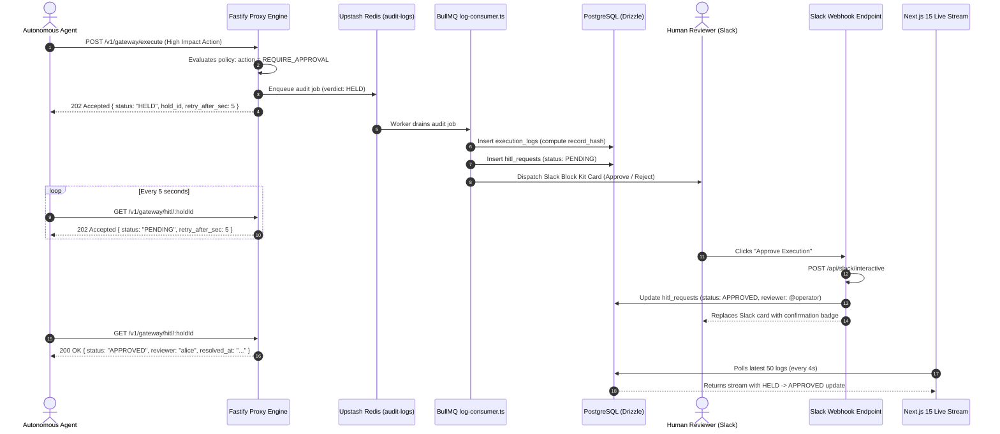

# Phase 4 Documentation: Live Telemetry, Audit Logs & Slack HITL

**Phase Status:** ✅ **COMPLETED & VERIFIED**  
**Monorepo Components Implemented:**
- `@x4g4t/proxy`: `src/workers/log-consumer.ts`, `src/routes/hitl-poll.ts`
- `@x4g4t/web`: `app/api/slack/interactive/route.ts`, `app/dashboard/logs/page.tsx`, `app/dashboard/logs/logs-stream-table.tsx`

---

## 1. Overview of Phase 4 Deliverables

Phase 4 bridges the firewall interception engine with real-world operations by implementing:
1. **Asynchronous Background Ingestion:** Decouples audit log database writes from the HTTP proxy hot path via BullMQ, maintaining $<15\text{ms}$ execution latency.
2. **Interactive Slack Human-in-the-Loop (HITL):** Dispatches rich Block Kit approval cards to SecOps/operators with interactive "Approve" and "Reject" buttons.
3. **Webhook Resolution Pipeline:** Processes button interactions, updates database review states, and provides live in-channel status cards.
4. **Suspended Agent Polling Loop:** Enables agents suspended with HTTP 202 `HELD` to poll `/v1/gateway/hitl/:holdId` until human resolution.
5. **Real-Time Execution Audit Stream:** Web dashboard interface with 4-second auto-refresh, colored verdict badges, latency metrics, and payload JSON drawers.

---

## 2. Component Architecture & Implementation Details



### A. BullMQ Consumer Worker (`apps/proxy/src/workers/log-consumer.ts`)
- **Worker Configuration:** Processes jobs from the `"audit-logs"` queue with concurrency 20.
- **Tamper-Evident Hashing:** Computes ISO 27001 cryptographic hash chain:
  $$\text{record\_hash} = \text{SHA256}(\text{id} + \text{previousRecordHash} + \text{toolName} + \text{verdict} + \text{createdAt})$$
- **HITL Detection:** When `data.verdict === "HELD"`, automatically creates a `hitlRequests` entry with status `"PENDING"` and invokes `sendSlackHitlCard`.
- **Slack Block Kit Generator (`buildSlackHitlPayload`):**
  - Section with Agent ID and Target Tool.
  - Formatted JSON arguments code block.
  - Two interactive button actions: `Approve Execution` (`style: "primary"`) and `Reject / Terminate` (`style: "danger"`), passing encoded `{ action, hitlId }` values.

### B. Suspended Agent Polling Route (`apps/proxy/src/routes/hitl-poll.ts`)
- **Route:** `GET /v1/gateway/hitl/:holdId`
- **Tenant Isolation:** Joins `hitlRequests` with `executionLogs` to enforce `executionLogs.orgId = request.orgId`.
- **Status Responses:**
  - `status === "PENDING"`: Returns HTTP 202 Accepted with `{ status: "PENDING", retry_after_sec: 5 }`.
  - `status === "APPROVED"` or `"REJECTED"`: Returns HTTP 200 OK with `{ status, reviewer, resolved_at }`.
  - Non-existent or cross-tenant hold ID: Returns HTTP 404 with `HOLD_NOT_FOUND`.

### C. Slack Interactive Webhook Receiver (`apps/web/app/api/slack/interactive/route.ts`)
- **Route:** `POST /api/slack/interactive`
- Parses url-encoded Slack interaction payload.
- Extracts `action.value` containing `{ action: "APPROVED" | "REJECTED", hitlId }`.
- Updates `hitlRequests` table:
  - `status`: `"APPROVED"` | `"REJECTED"`
  - `reviewerId`: Slack user identifier
  - `resolvedAt`: Timestamp
  - `resolutionReason`: `"Resolved via Slack by @<username>"`
- Returns Slack in-channel replacement message replacing the action buttons with an approved or rejected confirmation banner.

### D. Real-Time Telemetry Stream Viewer (`apps/web/app/dashboard/logs`)
- **Client Table (`logs-stream-table.tsx`):**
  - Live auto-refreshing polling loop every 4 seconds using Next.js `router.refresh()`.
  - Animated pulsing green live indicator badge: `STREAMING ACTIVE (polling every 4s)`.
  - Manual "Force Refresh" button with rotating SVG animation.
  - Color-coded verdict badges (`ALLOW`: emerald, `BLOCK`: rose, `HELD`: amber).
  - Modal dialog with formatted JSON syntax display for inspecting sanitized arguments.

---

## 3. Automated Test Suite & Verification

All test suites executed with a **100% pass rate**:

### Proxy Test Suite (15 tests)
```bash
pnpm --filter @x4g4t/proxy test
```
```text
✓ test/execute.test.ts (9 tests)
✓ test/hitl-poll.test.ts (5 tests)
  ✓ should return 401 UNAUTHORIZED when called without Bearer token
  ✓ should return 404 HOLD_NOT_FOUND for non-existent holdId
  ✓ should return 202 Accepted with PENDING status when hold is unresolved
  ✓ should return 200 OK with APPROVED verdict when resolved by human
  ✓ should return 200 OK with REJECTED verdict when denied by operator
✓ test/log-consumer.test.ts (1 test)
  ✓ should generate compliant Slack Block Kit message payload
```

### Web Test Suite (12 tests)
```bash
pnpm --filter @x4g4t/web test
```
```text
✓ test/actions.test.ts (8 tests)
✓ test/slack-interactive.test.ts (4 tests)
  ✓ should return 400 when called with missing payload
  ✓ should return 400 on malformed JSON payload
  ✓ should process APPROVED action and return replacement Block Kit card
  ✓ should process REJECTED action and return replacement Block Kit card
```

### Full Monorepo Status (Phases 1–4)
```bash
pnpm turbo run test
```
```text
Tasks:    3 successful, 3 total
Time:     1.352s

Test Breakdown:
- @x4g4t/policy-engine: 36 passed
- @x4g4t/proxy:          15 passed
- @x4g4t/web:            12 passed
Total Automated Tests:      63 passed (100% pass rate)
```

