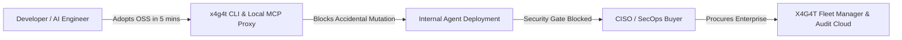
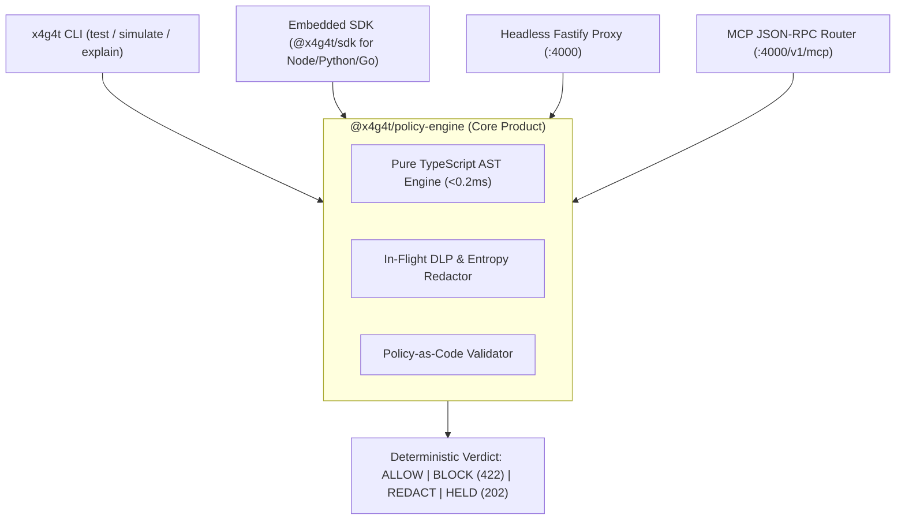
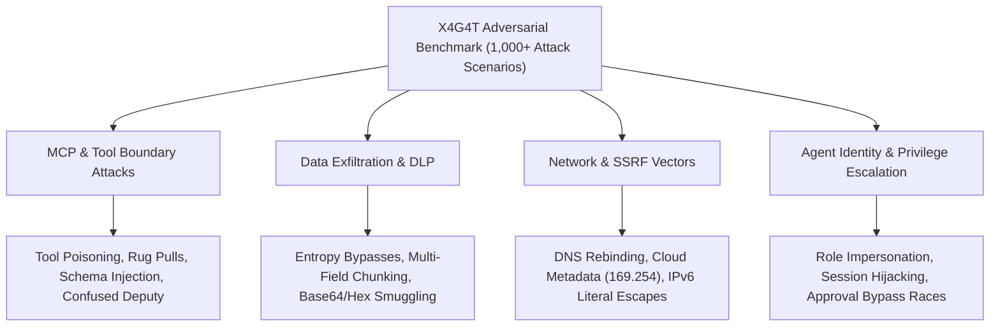

# X4G4T Strategic Blueprint: The Open-Source Agent Authorization & Enforcement Layer

> **Author**: ARYIX (OPC) Private Limited  
> **Brand**: X4G4T (`@aryix-hq/x4g4t`)  
> **Strategic Classification**: Product Strategy, ICP, Competitive Positioning & 12-Month Commercial Roadmap  
> **Date**: September 2026

---

## Executive Summary: The Strategic Pivot

X4G4T is pivoting away from the crowded, ambiguous framing of a generic *"AI Security Platform"* to own a precise, defensible, and high-growth category:

$$\text{\bf X4G4T is the open-source runtime authorization and enforcement layer for AI agents and MCP tools.}$$

Instead of treating the Fastify network proxy as the sole product, **the Policy Engine (`@x4g4t/policy-engine`) and its declarative Policy-as-Code CLI are the core product**. The HTTP proxy, MCP JSON-RPC router, and language SDKs are simply edge enforcement vectors.

```
Traditional Security:
  User ──────▶ Web App ──────▶ WAF / API Gateway ──────▶ Database / Backend

Agentic AI Reality:
  User ──────▶ AI Agent ─────▶ [ X4G4T RUNTIME FIREWALL ] ─────▶ Tool / MCP / DB / SaaS
                                 ├── 6-Tuple Agent Identity
                                 ├── Deterministic AST Policy-as-Code
                                 ├── In-Flight Secret & PII Redaction
                                 ├── Stateful Human-in-the-Loop (HITL)
                                 └── Cryptographic Audit Trail
```

---

## 1. Ideal Customer Profile (ICP) & Buyer Personas

The market has a clear divide between **the builder who adopts** and **the security leader who mandates and pays**.



### Primary Personas

| Dimension | User / Champion Persona | Economic Buyer Persona |
| :--- | :--- | :--- |
| **Title** | Staff AI Engineer, Lead Platform Engineer, MLOps Architect | CISO, VP of Information Security, Head of SecOps / Governance |
| **Org Profile** | Tech-forward scale-ups (Series B–D) & Enterprises (500–10,000+ employees) deploying customer-facing or internal autonomous agents | Mid-market to Fortune 500 enterprises with regulated workloads (Fintech, Healthtech, Insurtech, Enterprise SaaS) |
| **Core Problem** | "Our agent is running tools that can mutate production data, leak credentials, or hallucinate dangerous arguments, but we can't afford latency or complex security frameworks." | "Engineering is deploying AI agents with direct access to Salesforce, Postgres, and Stripe. We have zero visibility, zero audit trails, and our SOC2/HIPAA auditors will fail us." |
| **Value Proposition** | 5-minute install, zero-latency local testing (`x4g4t test`), vendor-neutral SDK, deterministic AST execution. | Turn-key policy-as-code enforcement, complete agent inventory, cryptographic tamper-evident audits, and 1-click HITL escalation. |
| **Primary Friction** | Existing enterprise security tools (Palo Alto, Cisco) are heavy network appliances built for network admins, not developers. | Open-source hobby scripts (`mcp-firewall`) lack enterprise RBAC, multi-tenant policy sync, and compliance SLAs. |

---

## 2. Competitive Wedge & Market Positioning

```
                    High Enterprise Control
                             │
                  Palo Alto  │  X4G4T Enterprise
                  Prisma AIRS│  (Fleet Control Plane)
                             │
     Proprietary / Locked    │                Open-Source / Neutral
  ───────────────────────────┼───────────────────────────────────────
     Google Agent Gateway    │  X4G4T Core (Apache 2.0)
     AWS Bedrock Guardrails  │  
                             │  mcp-firewall / kvlar
                             │  (Simple Regex Scripts)
                             ▼
                     Developer Ergonomics
```

### The Three Competitive Pillars

1. **Vendor Neutrality (The Anti-Lock-In Wedge)**:
   - Google Agent Gateway and AWS Bedrock Guardrails lock customers into their respective cloud ecosystems.
   - X4G4T sits agnostically between **any agent** (Cursor, Claude Desktop, LangGraph, CrewAI, AutoGen, custom agents) and **any backend** (Ollama on a laptop, private VPC clusters, or multi-cloud LLMs).
2. **Deterministic Sub-Millisecond Policy-as-Code (The Anti-Appliance Wedge)**:
   - Legacy enterprise WAFs and security gateways inject 50–200ms of latency and require complex network routing.
   - X4G4T's pure TypeScript AST evaluator executes in **<200µs**, with declarative YAML definitions version-controlled directly in Git alongside application code.
3. **The 6-Tuple Contextual Agent Identity (The Anti-Regex Wedge)**:
   - Hobbyist MCP filters only check simple keyword bans (e.g. `DROP TABLE`).
   - X4G4T evaluates the complete contextual execution tuple:
     $$\langle \text{Human Identity}, \text{Agent Identity}, \text{Session / Chain}, \text{Tool}, \text{Target Data}, \text{Operation / Intent} \rangle$$

---

## 3. Architecture Evolution: Engine-First Decoupling

The policy engine is the central asset. We decouple the engine from the Fastify proxy to allow **three distinct consumption modes**:



### Declarative Policy-as-Code Specification (`x4g4t.yaml`)

```yaml
version: "1.0"
metadata:
  name: "production-data-governance"
  description: "Enforces least-privilege tool execution for Customer Support agents"

identities:
  - role: "support-agent"
    allowed_tools:
      - "salesforce.customer_lookup"
      - "postgres.read_order"
      - "stripe.issue_refund"
    denied_tools:
      - "postgres.drop_table"
      - "shell.execute"
      - "aws.s3_export"

rules:
  - id: "rule_refund_threshold"
    tool: "stripe.issue_refund"
    condition:
      and:
        - field: "arguments.amount"
          operator: "LESS_THAN_OR_EQUAL"
          value: 100
        - field: "arguments.currency"
          operator: "EQUALS"
          value: "USD"
    action: "ALLOW"
    on_fail:
      action: "HELD"
      reason: "Refunds over $100 require human supervisor approval"
      hitl_channel: "slack-finance-approvals"

  - id: "rule_no_raw_sql"
    tool: "postgres.query"
    condition:
      field: "arguments.sql"
      operator: "DOES_NOT_MATCH_REGEX"
      pattern: "(?i)(DROP|ALTER|TRUNCATE|DELETE\\s+FROM)"
    action: "ALLOW"
    on_fail:
      action: "BLOCK"
      status_code: 422

dlp:
  inbound:
    redact: ["CREDIT_CARD", "US_SSN", "AADHAAR", "AWS_SECRET_KEY"]
  egress:
    redact: ["OPENAI_API_KEY", "JWT_TOKEN", "PRIVATE_KEY"]
```

### Developer CLI Experience

```bash
# Verify policy syntax and lint against schemas
x4g4t lint policy.yaml

# Run unit tests against simulated tool execution payloads
x4g4t test --policy policy.yaml --fixtures ./tests/scenarios/

# Explain why a specific live tool call was blocked or held
x4g4t explain --policy policy.yaml --payload '{"tool":"stripe.issue_refund","arguments":{"amount":250}}'

# Launch local zero-config MCP proxy for Cursor or Claude Desktop
x4g4t mcp --target http://localhost:8080/sse --policy policy.yaml
```

---

## 4. The Open-Core Commercial Monetization Model

```
┌─────────────────────────────────────────────────────────────────────────────┐
│                 COMMUNITY OPEN-SOURCE CORE (Apache 2.0)                     │
│  • Pure TypeScript AST Policy Engine (@x4g4t/policy-engine)                 │
│  • Developer CLI (x4g4t lint / test / explain)                              │
│  • Headless Fastify Proxy & MCP JSON-RPC 2.0 Interceptor                    │
│  • Sub-millisecond Shannon Entropy & Regex DLP Redaction                    │
│  • Local SQLite / PostgreSQL In-Memory State & Metrics                      │
│  • Single-Node Docker Quickstart & Local Developer Setup                    │
└──────────────────────────────────────┬──────────────────────────────────────┘
                                       │
                                       ▼ Upgrades to
┌─────────────────────────────────────────────────────────────────────────────┐
│                   ENTERPRISE COMMERCIAL EDITION (Proprietary)               │
│  • Central Fleet Control Plane (Manage 10,000+ distributed proxy nodes)     │
│  • GitOps Centralized Policy Sync & Real-Time Fleet Rollouts                │
│  • Multi-Tenant RBAC with SAML 2.0 / OIDC / SCIM Integration               │
│  • Cryptographic WORM Compliance Storage (Immutable Audit Records)          │
│  • Multi-Channel Stateful HITL Engine (Slack Block Kit, Teams, Email)       │
│  • Enterprise SIEM Ingestion (Splunk, Datadog, Elastic, Graylog Cloud)     │
│  • Dynamic Token Spend Budgets & Enterprise Agent Fleet Analytics           │
│  • Dedicated 24/7 Production SLA & Enterprise Hardened Binders              │
└─────────────────────────────────────────────────────────────────────────────┘
```

---

## 5. The Competitive Moat: The Adversarial Agent Security Benchmark

Instead of competing on superficial features, X4G4T will build the industry's most rigorous open-source adversarial test suite: **The X4G4T Agent Security Benchmark (ASB)**.



By publishing quarterly reports mapping these test scenarios to the **OWASP 2026 Agentic AI Top 10**, X4G4T establishes independent authority and creates the de facto standard for evaluating agent runtime safety.

---

## 6. 12-Month Phased Strategic Roadmap

```mermaid
gantt
    title X4G4T 12-Month Strategic Execution Plan
    dateFormat  YYYY-MM
    section Q4 2026 (Foundations)
    M1: 5-Minute MCP Developer Drop-In      :done, m1, 2026-10, 2026-11
    M2: Policy-as-Code CLI & Test Engine    :active, m2, 2026-11, 2026-12
    section Q1 2027 (Identity & Frameworks)
    M3: 6-Tuple Agent Identity Matrix       :m3, 2027-01, 2027-02
    M4: Universal Framework SDKs (Python/TS):m4, 2027-02, 2027-03
    section Q2 2027 (Adversarial Benchmark)
    M5: 1,000+ Attack Scenario Corpus       :m5, 2027-04, 2027-05
    M6: Public OWASP Agentic Benchmark Site :m6, 2027-05, 2027-06
    section Q3-Q4 2027 (Commercial Scale)
    M7: Enterprise Fleet Control Plane      :m7, 2027-07, 2027-09
    M8: GitOps Policy Sync & Multi-Cloud    :m8, 2027-09, 2027-11
```

### Detailed Quarterly Milestones

#### Phase 1: Near-Term (Q4 2026 — Zero-Friction Developer Adoption)
- **Milestone 1 (5-Minute MCP Drop-In)**:
  - Zero-config binary (`npx @x4g4t/cli mcp`) that wraps any local or remote MCP server with default OWASP-compliant guardrails.
  - 1-click configs for Cursor (`~/.cursor/mcp.json`) and Claude Desktop (`claude_desktop_config.json`).
- **Milestone 2 (Policy-as-Code & Testing Engine)**:
  - Declarative YAML policy engine with `x4g4t test` and `x4g4t explain`.
  - GitHub Actions CI/CD integration to lint and test policies on every pull request.

#### Phase 2: Medium-Term (Q1 2027 — Contextual Agent Identity & SDKs)
- **Milestone 3 (6-Tuple Agent Identity Integration)**:
  - Dynamic binding of user identity (Clerk, Okta, OIDC) with agent session ID and tool scopes.
  - Enforce least-privilege tool execution per session, preventing confused-deputy attacks.
- **Milestone 4 (Universal Language SDKs)**:
  - Native Python (`pip install x4g4t`) and TypeScript SDKs to allow LangGraph, CrewAI, AutoGen, and Semantic Kernel developers to embed the policy engine directly in-process without running an external proxy container.

#### Phase 3: Expansion (Q2 2027 — The Adversarial Benchmark Moat)
- **Milestone 5 (1,000+ Attack Scenario Corpus)**:
  - Publish open-source test suite covering tool poisoning, SSRF bypasses, and data exfiltration vectors.
- **Milestone 6 (Stateful HITL Multi-Channel Dispatcher)**:
  - Interactive Slack Block Kit and Microsoft Teams 1-click approvals with timeout fallbacks and audit logs.

#### Phase 4: Long-Term (Q3–Q4 2027 — Enterprise Commercial Fleet Scale)
- **Milestone 7 (Enterprise Fleet Management Plane)**:
  - Centralized dashboard managing distributed proxies across multiple Kubernetes clusters and cloud VPCs.
- **Milestone 8 (Compliance & GitOps Policy Distribution)**:
  - Automated policy rollouts via GitOps with automated rollback on anomaly detection.
  - Pre-packaged SOC2 Type II, HIPAA, and PCI-DSS compliance evidence packages.

---

## 7. North Star Metrics

We track success not by feature volume, but by three operational metrics:

1. **Number of Agents Protected**:
   $$\text{Target}: 100 \longrightarrow 1,000 \longrightarrow 10,000 \text{ active agents}$$
2. **Number of Tool Calls Enforced**:
   $$\text{Target}: 10\text{M} \longrightarrow 100\text{M} \longrightarrow 1\text{B} \text{ tool calls/month}$$
3. **Deterministic Decisions Rendered**:
   $$\text{Tracked via Telemetry}: \sum (\text{ALLOW} + \text{DENY} + \text{REDACT} + \text{HELD})$$
